# AyaOS Architecture Documentation

## Documentation Index

This documentation contains the following major sections:

1. **[High-Level System Architecture](#high-level-system-architecture)** - Overall system overview
2. **[Core Agent Architecture](#core-agent-architecture)** - Agent class hierarchy and initialization
3. **[Service Architecture](#service-architecture)** - Core services and their interactions
4. **[Plugin System Architecture](#plugin-system-architecture)** - Plugin lifecycle and extensibility
5. **[Platform Integrations](#platform-integrations)** - Communication platform implementations
6. **[Data Flow Diagrams](#data-flow-diagrams)** - Information flow through key operations
7. **[Manager and Provider Interactions](#manager-and-provider-interactions)** - Infrastructure and context management
8. **[Event System and Message Flow](#event-system-and-message-flow)** - Event-driven architecture details
9. **[Deployment and Runtime Architecture](#deployment-and-runtime-architecture)** - Production deployment patterns

Each section includes detailed Mermaid diagrams that illustrate the relationships, flows, and patterns specific to that architectural concern.

---

*This documentation was generated based on the AyaOS codebase and represents the current architectural state. For the most up-to-date information, please refer to the source code and official AyaOS documentation.*

## Overview

AyaOS is a high-level framework built on top of ElizaOS for creating autonomous AI agents. It provides a comprehensive system for building, customizing, and deploying AI agents with advanced capabilities across multiple communication platforms.

## High-Level System Architecture

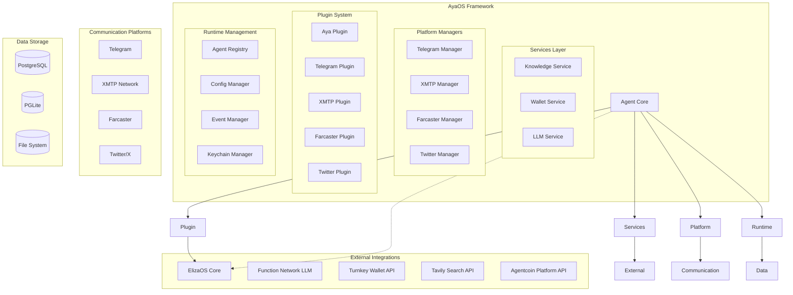
```mermaid
graph TB
    subgraph "AyaOS Framework"
        Agent[Agent Core]
        
        subgraph "Services Layer"
            KnowledgeService[Knowledge Service]
            WalletService[Wallet Service]
            LLMService[LLM Service]
        end
        
        subgraph "Platform Managers"
            TelegramManager[Telegram Manager]
            XMTPManager[XMTP Manager]
            FarcasterManager[Farcaster Manager]
            TwitterManager[Twitter Manager]
        end
        
        subgraph "Plugin System"
            AyaPlugin[Aya Plugin]
            TelegramPlugin[Telegram Plugin]
            XMTPPlugin[XMTP Plugin]
            FarcasterPlugin[Farcaster Plugin]
            TwitterPlugin[Twitter Plugin]
        end
        
        subgraph "Runtime Management"
            AgentRegistry[Agent Registry]
            ConfigManager[Config Manager]
            EventManager[Event Manager]
            KeychainManager[Keychain Manager]
        end
    end
    
    subgraph "External Integrations"
        ElizaOS[ElizaOS Core]
        FunctionNetwork[Function Network LLM]
        TurnkeyAPI[Turnkey Wallet API]
        TavilyAPI[Tavily Search API]
        AgentcoinAPI[Agentcoin Platform API]
    end
    
    subgraph "Communication Platforms"
        Telegram[Telegram]
        XMTP[XMTP Network]
        Farcaster[Farcaster]
        Twitter[Twitter/X]
    end
    
    subgraph "Data Storage"
        PostgreSQL[(PostgreSQL)]
        PGLite[(PGLite)]
        FileSystem[(File System)]
    end
    
    Agent --> Services
    Agent --> Platform
    Agent --> Plugin
    Agent --> Runtime
    
    Services --> External
    Platform --> Communication
    Runtime --> Data
    Plugin --> ElizaOS
    
    Agent -.-> ElizaOS
```

## Core Components

### 1. Agent Core
The central [`Agent`](src/agent/agent.ts:70) class that orchestrates all system functionality:
- Manages runtime lifecycle
- Coordinates services and managers
- Handles plugin registration
- Manages character and context

### 2. Services Layer
Core services providing essential functionality:

#### Knowledge Service
- Vector-based knowledge management
- RAG (Retrieval-Augmented Generation) capabilities
- Support for multiple document formats (PDF, DOCX, CSV, TXT, Markdown)
- Embedding-based search with configurable similarity thresholds

#### Wallet Service
- Ethereum or Solana wallet management via Turnkey
- Message signing capabilities
- Multi-chain support preparation

#### LLM Service
- Text generation using configurable models
- Object generation with schema validation
- Embedding generation for knowledge indexing

### 3. Platform Integration
Managers for various communication platforms:
- **Telegram**: Full bot functionality with forum support
- **XMTP**: Decentralized messaging with encryption
- **Farcaster**: Social protocol integration
- **Twitter**: Social media posting and interaction

### 4. Plugin Architecture
Modular system for extending agent capabilities:
- Action registration (tools the agent can use)
- Provider registration (context injection)
- Service registration (background capabilities)
- Event handler registration

### 5. Runtime Management
System management components:
- **Agent Registry**: Lifecycle and context management
- **Config Manager**: Configuration monitoring and updates
- **Event Manager**: Event processing and distribution
- **Keychain Manager**: Secure key storage and management

## Key Design Patterns

### 1. Service-Oriented Architecture
Each major capability is encapsulated as a service with standardized interfaces.

### 2. Event-Driven Communication
Loose coupling between components through comprehensive event system.

### 3. Plugin-Based Extensibility
Modular architecture allowing easy addition of new capabilities.

### 4. Multi-Platform Abstraction
Unified interface for different communication platforms.

### 5. Configuration-Driven Behavior
Runtime behavior controlled through environment variables and character files.

## Next Sections

1. [Core Agent Architecture](#core-agent-architecture)
2. [Service Architecture](#service-architecture)
3. [Plugin System](#plugin-system)
4. [Platform Integrations](#platform-integrations)
5. [Data Flow](#data-flow)
6. [Event System](#event-system)
7. [Deployment Architecture](#deployment-architecture)

---

## Core Agent Architecture

The core agent architecture is built around the [`Agent`](src/agent/agent.ts:70) class which implements the [`IAyaAgent`](src/agent/iagent.ts:5) interface. This section details the class relationships and initialization flow.

### Agent Class Hierarchy

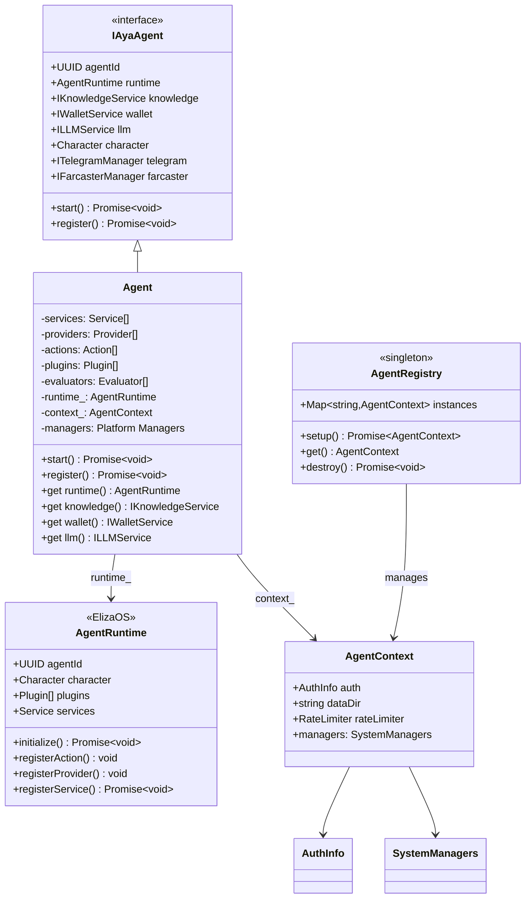
```mermaid
classDiagram
    class IAyaAgent {
        <<interface>>
        +UUID agentId
        +AgentRuntime runtime
        +IKnowledgeService knowledge
        +IWalletService wallet
        +ILLMService llm
        +Character character
        +ITelegramManager telegram
        +IFarcasterManager farcaster
        +start() Promise~void~
        +register() Promise~void~
    }
    
    class Agent {
        -services: Service[]
        -providers: Provider[]
        -actions: Action[]
        -plugins: Plugin[]
        -evaluators: Evaluator[]
        -runtime_: AgentRuntime
        -context_: AgentContext
        -managers: Platform Managers
        +start() Promise~void~
        +register() Promise~void~
        +get runtime() AgentRuntime
        +get knowledge() IKnowledgeService
        +get wallet() IWalletService
        +get llm() ILLMService
    }
    
    class AgentRuntime {
        <<ElizaOS>>
        +UUID agentId
        +Character character
        +Plugin[] plugins
        +Service services
        +initialize() Promise~void~
        +registerAction() void
        +registerProvider() void
        +registerService() Promise~void~
    }
    
    class AgentContext {
        +AuthInfo auth
        +string dataDir
        +RateLimiter rateLimiter
        +managers: SystemManagers
    }
    
    class AgentRegistry {
        <<singleton>>
        +Map~string,AgentContext~ instances
        +setup() Promise~AgentContext~
        +get() AgentContext
        +destroy() Promise~void~
    }
    
    IAyaAgent <|-- Agent
    Agent --> AgentRuntime : runtime_
    Agent --> AgentContext : context_
    AgentRegistry --> AgentContext : manages
    AgentContext --> AuthInfo
    AgentContext --> SystemManagers
```

### Agent Initialization Flow

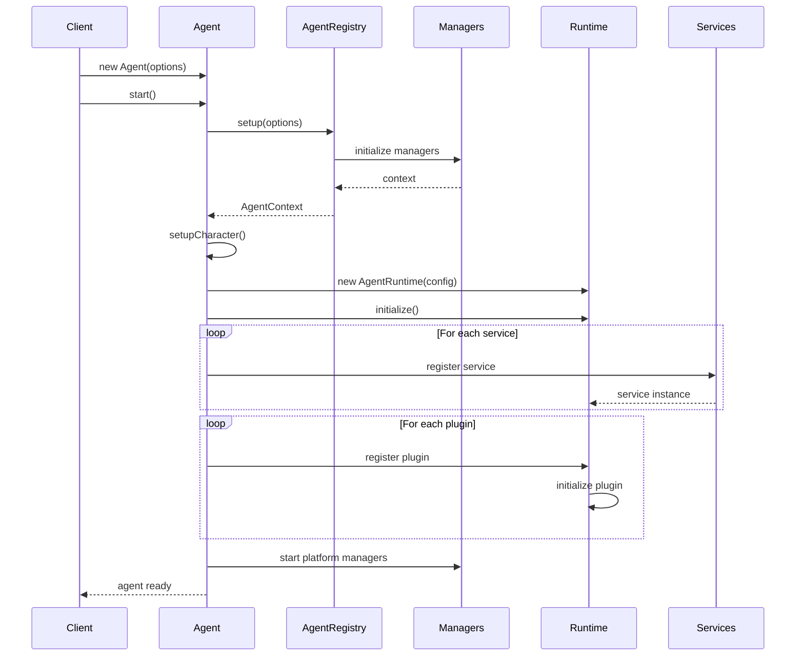
```mermaid
sequenceDiagram
    participant Client
    participant Agent
    participant AgentRegistry
    participant Managers
    participant Runtime
    participant Services
    
    Client->>Agent: new Agent(options)
    Client->>Agent: start()
    
    Agent->>AgentRegistry: setup(options)
    AgentRegistry->>Managers: initialize managers
    Managers-->>AgentRegistry: context
    AgentRegistry-->>Agent: AgentContext
    
    Agent->>Agent: setupCharacter()
    Agent->>Runtime: new AgentRuntime(config)
    Agent->>Runtime: initialize()
    
    loop For each service
        Agent->>Services: register service
        Services-->>Runtime: service instance
    end
    
    loop For each plugin
        Agent->>Runtime: register plugin
        Runtime->>Runtime: initialize plugin
    end
    
    Agent->>Managers: start platform managers
    Agent-->>Client: agent ready
```

### Service Integration Pattern

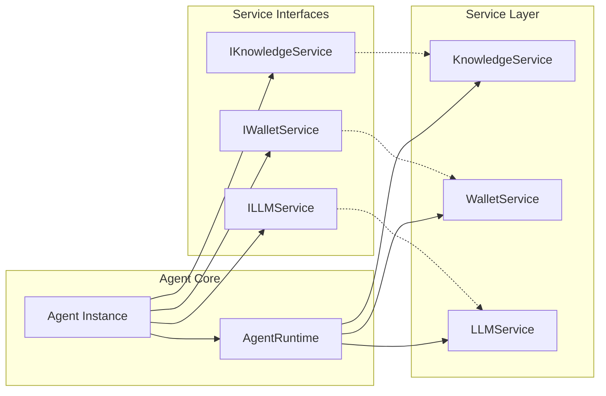
```mermaid
graph LR
    subgraph "Agent Core"
        Agent[Agent Instance]
        Runtime[AgentRuntime]
    end
    
    subgraph "Service Layer"
        KS[KnowledgeService]
        WS[WalletService]
        LS[LLMService]
    end
    
    subgraph "Service Interfaces"
        IKS[IKnowledgeService]
        IWS[IWalletService]
        ILS[ILLMService]
    end
    
    Agent --> Runtime
    Agent --> IKS
    Agent --> IWS
    Agent --> ILS
    
    IKS -.-> KS
    IWS -.-> WS
    ILS -.-> LS
    
    Runtime --> KS
    Runtime --> WS
    Runtime --> LS
```

### Manager Architecture

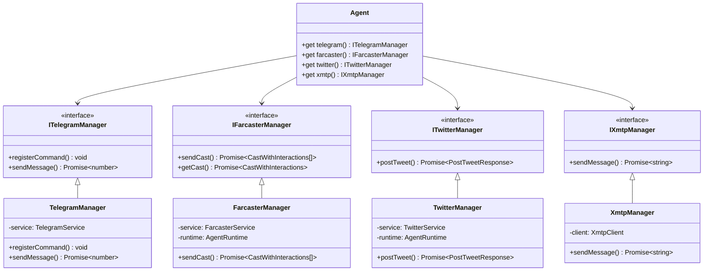
```mermaid
classDiagram
    class Agent {
        +get telegram() ITelegramManager
        +get farcaster() IFarcasterManager
        +get twitter() ITwitterManager
        +get xmtp() IXmtpManager
    }
    
    class ITelegramManager {
        <<interface>>
        +registerCommand() void
        +sendMessage() Promise~number~
    }
    
    class IFarcasterManager {
        <<interface>>
        +sendCast() Promise~CastWithInteractions[]~
        +getCast() Promise~CastWithInteractions~
    }
    
    class ITwitterManager {
        <<interface>>
        +postTweet() Promise~PostTweetResponse~
    }
    
    class IXmtpManager {
        <<interface>>
        +sendMessage() Promise~string~
    }
    
    class TelegramManager {
        -service: TelegramService
        +registerCommand() void
        +sendMessage() Promise~number~
    }
    
    class FarcasterManager {
        -service: FarcasterService
        -runtime: AgentRuntime
        +sendCast() Promise~CastWithInteractions[]~
    }
    
    class TwitterManager {
        -service: TwitterService
        -runtime: AgentRuntime
        +postTweet() Promise~PostTweetResponse~
    }
    
    class XmtpManager {
        -client: XmtpClient
        +sendMessage() Promise~string~
    }
    
    Agent --> ITelegramManager
    Agent --> IFarcasterManager
    Agent --> ITwitterManager
    Agent --> IXmtpManager
    
    ITelegramManager <|-- TelegramManager
    IFarcasterManager <|-- FarcasterManager
    ITwitterManager <|-- TwitterManager
    IXmtpManager <|-- XmtpManager
```

### Key Architectural Principles

1. **Interface Segregation**: Each service and manager is accessed through well-defined interfaces
2. **Dependency Injection**: Services are injected into the agent runtime and accessed via getters
3. **Lazy Initialization**: Platform managers are created on-demand when first accessed
4. **Singleton Services**: Services are managed as singletons per agent instance
5. **Context Management**: Agent context encapsulates authentication, data directories, and system managers

## Service Architecture

The service layer provides core functionality through three main services: Knowledge, Wallet, and LLM services. Each service follows a consistent pattern with interfaces, implementations, and singleton management.

### Service Layer Overview

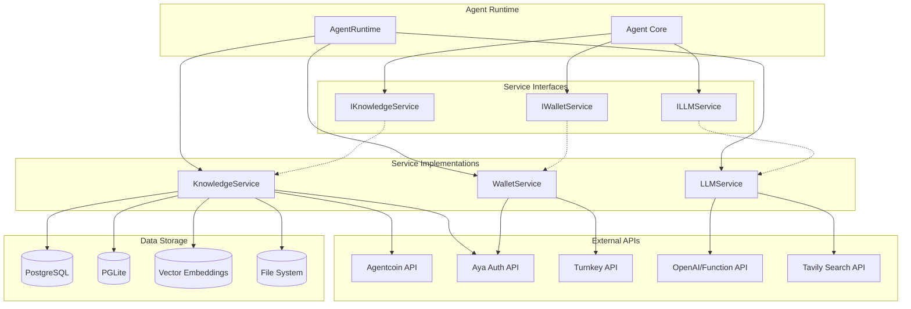
```mermaid
graph TB
    subgraph "Agent Runtime"
        Agent[Agent Core]
        Runtime[AgentRuntime]
    end
    
    subgraph "Service Interfaces"
        IKnowledgeService[IKnowledgeService]
        IWalletService[IWalletService]
        ILLMService[ILLMService]
    end
    
    subgraph "Service Implementations"
        KnowledgeService[KnowledgeService]
        WalletService[WalletService]
        LLMService[LLMService]
    end
    
    subgraph "External APIs"
        AgentcoinAPI[Agentcoin API]
        AyaAuthAPI[Aya Auth API]
        TurnkeyAPI[Turnkey API]
        OpenAIAPI[OpenAI/Function API]
        TavilyAPI[Tavily Search API]
    end
    
    subgraph "Data Storage"
        PostgreSQL[(PostgreSQL)]
        PGLite[(PGLite)]
        VectorDB[(Vector Embeddings)]
        FileSystem[(File System)]
    end
    
    Agent --> IKnowledgeService
    Agent --> IWalletService
    Agent --> ILLMService
    
    Runtime --> KnowledgeService
    Runtime --> WalletService
    Runtime --> LLMService
    
    IKnowledgeService -.-> KnowledgeService
    IWalletService -.-> WalletService
    ILLMService -.-> LLMService
    
    KnowledgeService --> AgentcoinAPI
    KnowledgeService --> AyaAuthAPI
    KnowledgeService --> PostgreSQL
    KnowledgeService --> PGLite
    KnowledgeService --> VectorDB
    KnowledgeService --> FileSystem
    
    WalletService --> TurnkeyAPI
    WalletService --> AyaAuthAPI
    
    LLMService --> OpenAIAPI
    LLMService --> TavilyAPI
```

### Knowledge Service Architecture

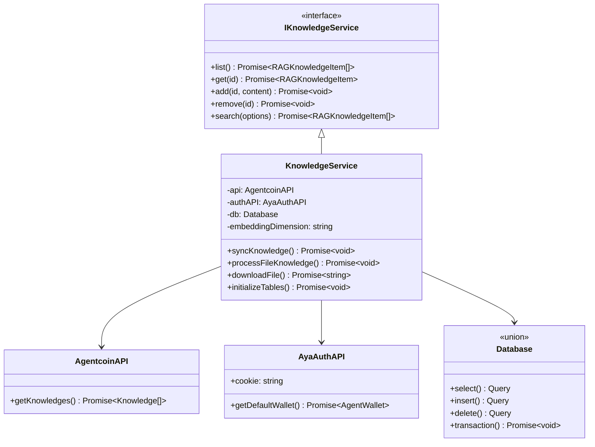
```mermaid
classDiagram
    class IKnowledgeService {
        <<interface>>
        +list() Promise~RAGKnowledgeItem[]~
        +get(id) Promise~RAGKnowledgeItem~
        +add(id, content) Promise~void~
        +remove(id) Promise~void~
        +search(options) Promise~RAGKnowledgeItem[]~
    }
    
    class KnowledgeService {
        -api: AgentcoinAPI
        -authAPI: AyaAuthAPI
        -db: Database
        -embeddingDimension: string
        +syncKnowledge() Promise~void~
        +processFileKnowledge() Promise~void~
        +downloadFile() Promise~string~
        +initializeTables() Promise~void~
    }
    
    class AgentcoinAPI {
        +getKnowledges() Promise~Knowledge[]~
    }
    
    class AyaAuthAPI {
        +cookie: string
        +getDefaultWallet() Promise~AgentWallet~
    }
    
    class Database {
        <<union>>
        +select() Query
        +insert() Query
        +delete() Query
        +transaction() Promise~void~
    }
    
    IKnowledgeService <|-- KnowledgeService
    KnowledgeService --> AgentcoinAPI
    KnowledgeService --> AyaAuthAPI
    KnowledgeService --> Database
```

### Knowledge Service Data Flow

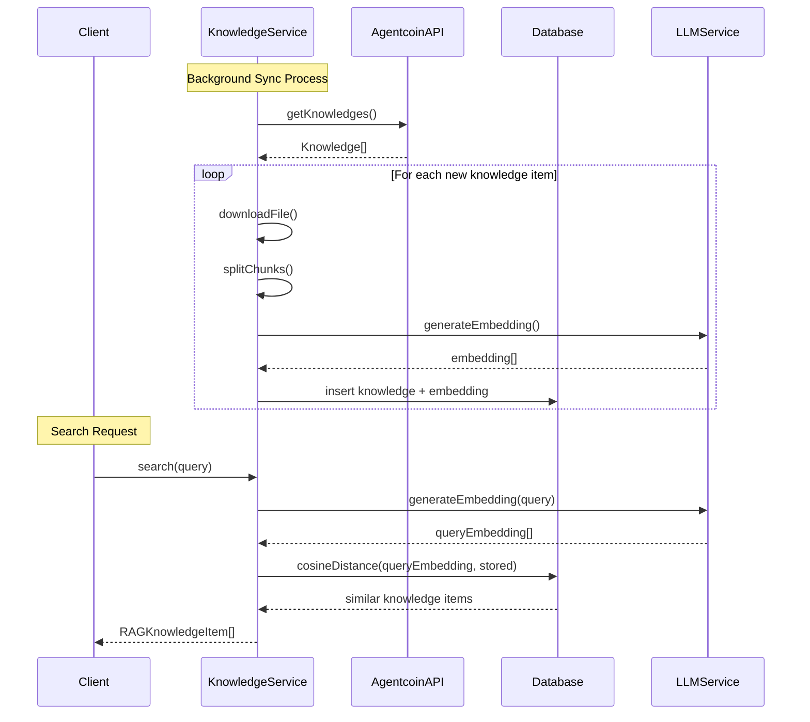
```mermaid
sequenceDiagram
    participant Client
    participant KS as KnowledgeService
    participant API as AgentcoinAPI
    participant DB as Database
    participant LLM as LLMService
    
    Note over KS: Background Sync Process
    KS->>API: getKnowledges()
    API-->>KS: Knowledge[]
    
    loop For each new knowledge item
        KS->>KS: downloadFile()
        KS->>KS: splitChunks()
        KS->>LLM: generateEmbedding()
        LLM-->>KS: embedding[]
        KS->>DB: insert knowledge + embedding
    end
    
    Note over Client: Search Request
    Client->>KS: search(query)
    KS->>LLM: generateEmbedding(query)
    LLM-->>KS: queryEmbedding[]
    KS->>DB: cosineDistance(queryEmbedding, stored)
    DB-->>KS: similar knowledge items
    KS-->>Client: RAGKnowledgeItem[]
```

### Wallet Service Architecture

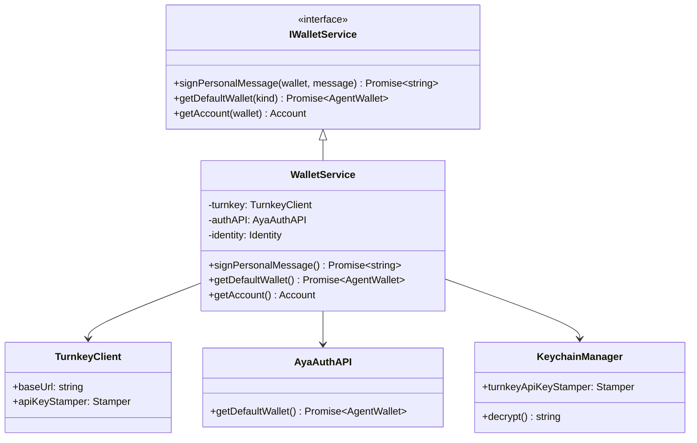
```mermaid
classDiagram
    class IWalletService {
        <<interface>>
        +signPersonalMessage(wallet, message) Promise~string~
        +getDefaultWallet(kind) Promise~AgentWallet~
        +getAccount(wallet) Account
    }
    
    class WalletService {
        -turnkey: TurnkeyClient
        -authAPI: AyaAuthAPI
        -identity: Identity
        +signPersonalMessage() Promise~string~
        +getDefaultWallet() Promise~AgentWallet~
        +getAccount() Account
    }
    
    class TurnkeyClient {
        +baseUrl: string
        +apiKeyStamper: Stamper
    }
    
    class AyaAuthAPI {
        +getDefaultWallet() Promise~AgentWallet~
    }
    
    class KeychainManager {
        +turnkeyApiKeyStamper: Stamper
        +decrypt() string
    }
    
    IWalletService <|-- WalletService
    WalletService --> TurnkeyClient
    WalletService --> AyaAuthAPI
    WalletService --> KeychainManager
```

### LLM Service Architecture

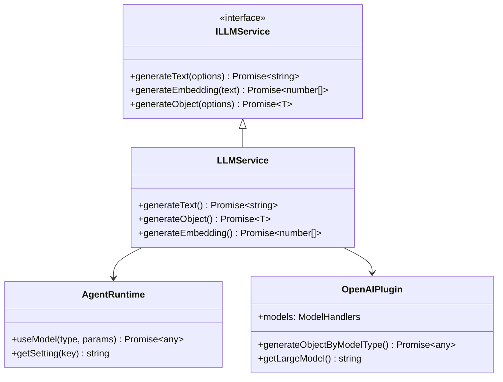
```mermaid
classDiagram
    class ILLMService {
        <<interface>>
        +generateText(options) Promise~string~
        +generateEmbedding(text) Promise~number[]~
        +generateObject(options) Promise~T~
    }
    
    class LLMService {
        +generateText() Promise~string~
        +generateObject() Promise~T~
        +generateEmbedding() Promise~number[]~
    }
    
    class AgentRuntime {
        +useModel(type, params) Promise~any~
        +getSetting(key) string
    }
    
    class OpenAIPlugin {
        +models: ModelHandlers
        +generateObjectByModelType() Promise~any~
        +getLargeModel() string
    }
    
    ILLMService <|-- LLMService
    LLMService --> AgentRuntime
    LLMService --> OpenAIPlugin
```

### Service Lifecycle Management

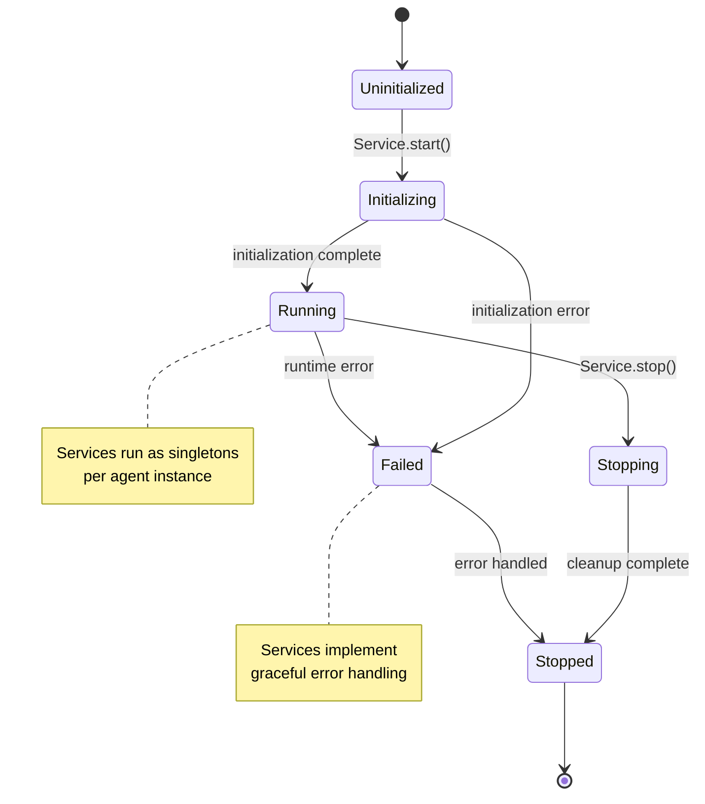
```mermaid
stateDiagram-v2
    [*] --> Uninitialized
    
    Uninitialized --> Initializing: Service.start()
    Initializing --> Running: initialization complete
    Initializing --> Failed: initialization error
    
    Running --> Stopping: Service.stop()
    Running --> Failed: runtime error
    
    Stopping --> Stopped: cleanup complete
    Failed --> Stopped: error handled
    
    Stopped --> [*]
    
    note right of Running
        Services run as singletons
        per agent instance
    end note
    
    note right of Failed
        Services implement
        graceful error handling
    end note
```

### Service Configuration Pattern

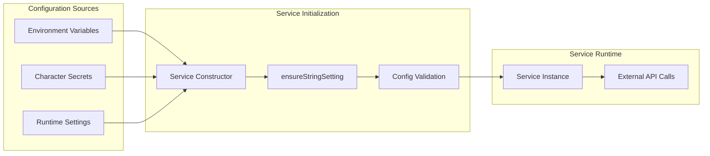
```mermaid
graph LR
    subgraph "Configuration Sources"
        EnvVars[Environment Variables]
        CharacterSecrets[Character Secrets]
        RuntimeSettings[Runtime Settings]
    end
    
    subgraph "Service Initialization"
        Constructor[Service Constructor]
        SettingHelper[ensureStringSetting]
        Validation[Config Validation]
    end
    
    subgraph "Service Runtime"
        ServiceInstance[Service Instance]
        ExternalAPI[External API Calls]
    end
    
    EnvVars --> Constructor
    CharacterSecrets --> Constructor
    RuntimeSettings --> Constructor
    
    Constructor --> SettingHelper
    SettingHelper --> Validation
    Validation --> ServiceInstance
    
    ServiceInstance --> ExternalAPI
```

### Key Service Patterns

1. **Singleton Management**: Each service type maintains a singleton instance per agent
2. **Interface Segregation**: Services expose minimal, focused interfaces
3. **Configuration Injection**: Settings injected at construction time from multiple sources
4. **Graceful Degradation**: Services handle errors without crashing the agent
5. **Background Processing**: Knowledge service runs continuous sync operations
6. **Database Abstraction**: Support for both PostgreSQL and PGLite backends

*This documentation provides a comprehensive overview of the AyaOS architecture. Each section below provides detailed diagrams and explanations of specific subsystems.*

## Plugin System Architecture

The plugin system provides a modular architecture for extending agent capabilities. Built on ElizaOS's plugin framework, AyaOS adds its own specialized plugins for platform integrations and core functionality.

### Plugin Architecture Overview

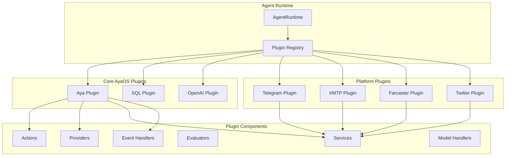
```mermaid
graph TB
    subgraph "Agent Runtime"
        Runtime[AgentRuntime]
        Registry[Plugin Registry]
    end
    
    subgraph "Core AyaOS Plugins"
        AyaPlugin[Aya Plugin]
        SqlPlugin[SQL Plugin]
        OpenAIPlugin[OpenAI Plugin]
    end
    
    subgraph "Platform Plugins"
        TelegramPlugin[Telegram Plugin]
        XMTPPlugin[XMTP Plugin]
        FarcasterPlugin[Farcaster Plugin]
        TwitterPlugin[Twitter Plugin]
    end
    
    subgraph "Plugin Components"
        Actions[Actions]
        Providers[Providers]
        Services[Services]
        Evaluators[Evaluators]
        Events[Event Handlers]
        Models[Model Handlers]
    end
    
    Runtime --> Registry
    Registry --> AyaPlugin
    Registry --> SqlPlugin
    Registry --> OpenAIPlugin
    Registry --> TelegramPlugin
    Registry --> XMTPPlugin
    Registry --> FarcasterPlugin
    Registry --> TwitterPlugin
    
    AyaPlugin --> Actions
    AyaPlugin --> Providers
    AyaPlugin --> Services
    AyaPlugin --> Events
    
    TelegramPlugin --> Services
    XMTPPlugin --> Services
    FarcasterPlugin --> Services
    TwitterPlugin --> Services
```

### Plugin Lifecycle

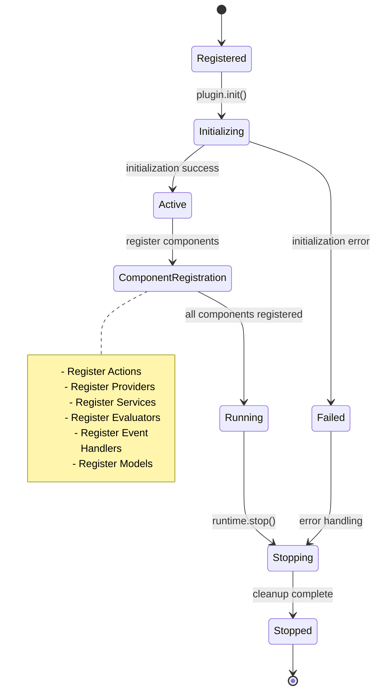
```mermaid
stateDiagram-v2
    [*] --> Registered
    
    Registered --> Initializing: plugin.init()
    Initializing --> Active: initialization success
    Initializing --> Failed: initialization error
    
    Active --> ComponentRegistration: register components
    ComponentRegistration --> Running: all components registered
    
    Running --> Stopping: runtime.stop()
    Failed --> Stopping: error handling
    
    Stopping --> Stopped: cleanup complete
    Stopped --> [*]
    
    note right of ComponentRegistration
        - Register Actions
        - Register Providers  
        - Register Services
        - Register Evaluators
        - Register Event Handlers
        - Register Models
    end note
```

### Plugin Registration Flow

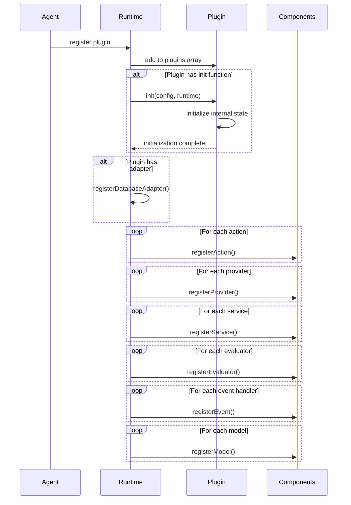
```mermaid
sequenceDiagram
    participant Agent
    participant Runtime
    participant Plugin
    participant Components
    
    Agent->>Runtime: register plugin
    Runtime->>Plugin: add to plugins array
    
    alt Plugin has init function
        Runtime->>Plugin: init(config, runtime)
        Plugin->>Plugin: initialize internal state
        Plugin-->>Runtime: initialization complete
    end
    
    alt Plugin has adapter
        Runtime->>Runtime: registerDatabaseAdapter()
    end
    
    loop For each action
        Runtime->>Components: registerAction()
    end
    
    loop For each provider
        Runtime->>Components: registerProvider()
    end
    
    loop For each service
        Runtime->>Components: registerService()
    end
    
    loop For each evaluator
        Runtime->>Components: registerEvaluator()
    end
    
    loop For each event handler
        Runtime->>Components: registerEvent()
    end
    
    loop For each model
        Runtime->>Components: registerModel()
    end
```

### Aya Plugin Architecture

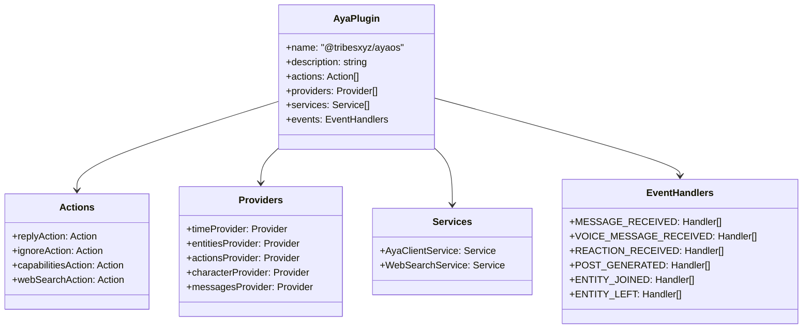
```mermaid
classDiagram
    class AyaPlugin {
        +name: "@tribesxyz/ayaos"
        +description: string
        +actions: Action[]
        +providers: Provider[]
        +services: Service[]
        +events: EventHandlers
    }
    
    class Actions {
        +replyAction: Action
        +ignoreAction: Action
        +capabilitiesAction: Action
        +webSearchAction: Action
    }
    
    class Providers {
        +timeProvider: Provider
        +entitiesProvider: Provider
        +actionsProvider: Provider
        +characterProvider: Provider
        +messagesProvider: Provider
    }
    
    class Services {
        +AyaClientService: Service
        +WebSearchService: Service
    }
    
    class EventHandlers {
        +MESSAGE_RECEIVED: Handler[]
        +VOICE_MESSAGE_RECEIVED: Handler[]
        +REACTION_RECEIVED: Handler[]
        +POST_GENERATED: Handler[]
        +ENTITY_JOINED: Handler[]
        +ENTITY_LEFT: Handler[]
    }
    
    AyaPlugin --> Actions
    AyaPlugin --> Providers
    AyaPlugin --> Services
    AyaPlugin --> EventHandlers
```

### Action System

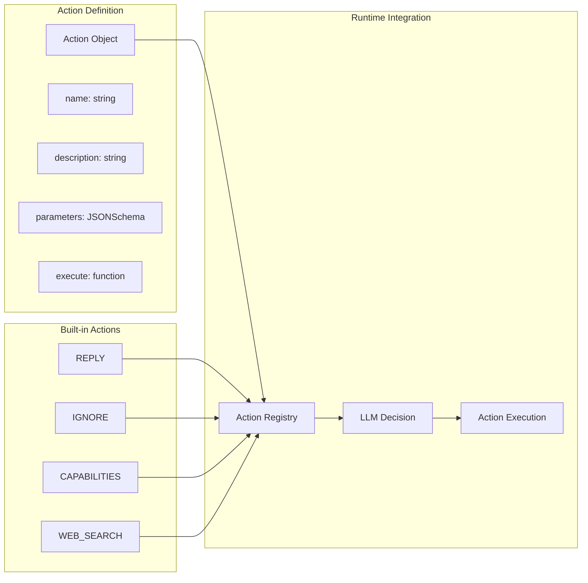
```mermaid
graph LR
    subgraph "Action Definition"
        Action[Action Object]
        Name[name: string]
        Description[description: string]
        Parameters[parameters: JSONSchema]
        Execute[execute: function]
    end
    
    subgraph "Runtime Integration"
        Registry[Action Registry]
        LLM[LLM Decision]
        Execution[Action Execution]
    end
    
    subgraph "Built-in Actions"
        Reply[REPLY]
        Ignore[IGNORE]
        Capabilities[CAPABILITIES]
        WebSearch[WEB_SEARCH]
    end
    
    Action --> Registry
    Registry --> LLM
    LLM --> Execution
    
    Reply --> Registry
    Ignore --> Registry
    Capabilities --> Registry
    WebSearch --> Registry
```

### Provider System

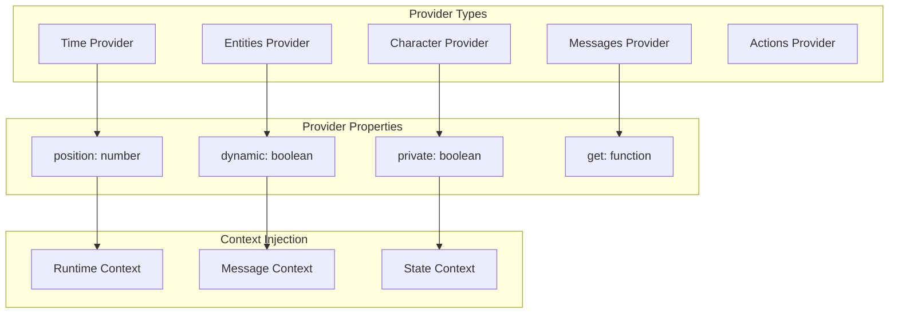
```mermaid
graph TB
    subgraph "Provider Types"
        TimeProvider[Time Provider]
        EntitiesProvider[Entities Provider]
        CharacterProvider[Character Provider]
        MessagesProvider[Messages Provider]
        ActionsProvider[Actions Provider]
    end
    
    subgraph "Provider Properties"
        Position[position: number]
        Dynamic[dynamic: boolean]
        Private[private: boolean]
        GetFunction[get: function]
    end
    
    subgraph "Context Injection"
        RuntimeContext[Runtime Context]
        MessageContext[Message Context]
        StateContext[State Context]
    end
    
    TimeProvider --> Position
    EntitiesProvider --> Dynamic
    CharacterProvider --> Private
    MessagesProvider --> GetFunction
    
    Position --> RuntimeContext
    Dynamic --> MessageContext
    Private --> StateContext
```

### Platform Plugin Pattern

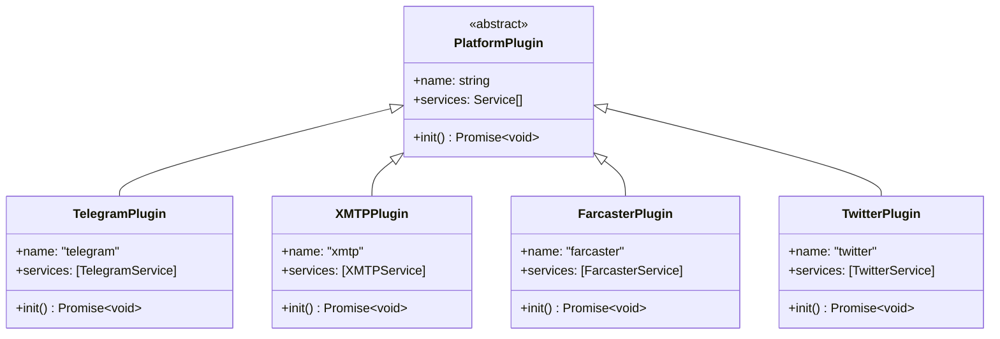
```mermaid
classDiagram
    class PlatformPlugin {
        <<abstract>>
        +name: string
        +services: Service[]
        +init() Promise~void~
    }
    
    class TelegramPlugin {
        +name: "telegram"
        +services: [TelegramService]
        +init() Promise~void~
    }
    
    class XMTPPlugin {
        +name: "xmtp"
        +services: [XMTPService]
        +init() Promise~void~
    }
    
    class FarcasterPlugin {
        +name: "farcaster"
        +services: [FarcasterService]
        +init() Promise~void~
    }
    
    class TwitterPlugin {
        +name: "twitter"
        +services: [TwitterService]
        +init() Promise~void~
    }
    
    PlatformPlugin <|-- TelegramPlugin
    PlatformPlugin <|-- XMTPPlugin
    PlatformPlugin <|-- FarcasterPlugin
    PlatformPlugin <|-- TwitterPlugin
```

### Plugin Configuration and Loading

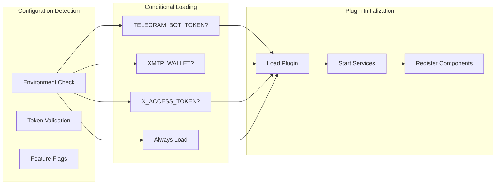
```mermaid
graph LR
    subgraph "Configuration Detection"
        EnvCheck[Environment Check]
        TokenCheck[Token Validation]
        FeatureFlag[Feature Flags]
    end
    
    subgraph "Conditional Loading"
        TelegramCheck[TELEGRAM_BOT_TOKEN?]
        XMTPCheck[XMTP_WALLET?]
        TwitterCheck[X_ACCESS_TOKEN?]
        FarcasterCheck[Always Load]
    end
    
    subgraph "Plugin Initialization"
        PluginLoad[Load Plugin]
        ServiceStart[Start Services]
        ComponentRegister[Register Components]
    end
    
    EnvCheck --> TelegramCheck
    EnvCheck --> XMTPCheck
    EnvCheck --> TwitterCheck
    EnvCheck --> FarcasterCheck
    
    TelegramCheck --> PluginLoad
    XMTPCheck --> PluginLoad
    TwitterCheck --> PluginLoad
    FarcasterCheck --> PluginLoad
    
    PluginLoad --> ServiceStart
    ServiceStart --> ComponentRegister
```

### Key Plugin Patterns

1. **Conditional Loading**: Platform plugins load only when required configuration is present
2. **Service Integration**: Each platform plugin provides a corresponding service
3. **Event-Driven**: Plugins register event handlers for lifecycle management
4. **Modular Actions**: Core functionality exposed through standardized actions
5. **Context Providers**: Dynamic context injection through provider system
6. **Graceful Failures**: Plugin initialization failures don't crash the agent

## Platform Integrations

AyaOS provides native integrations with multiple communication platforms, each with specialized handling for platform-specific features and protocols.

### Platform Integration Overview

```mermaid
graph TB
    subgraph "AyaOS Agent"
        Agent[Agent Core]
        Runtime[Agent Runtime]
    end
    
    subgraph "Platform Services"
        TelegramService[Telegram Service]
        XMTPService[XMTP Service]
        FarcasterService[Farcaster Service]
        TwitterService[Twitter Service]
    end
    
    subgraph "Platform Managers"
        TelegramManager[Telegram Manager]
        XMTPManager[XMTP Manager]
        FarcasterManager[Farcaster Manager]
        TwitterManager[Twitter Manager]
    end
    
    subgraph "External Platforms"
        Telegram[Telegram Bot API]
        XMTP[XMTP Network]
        Farcaster[Farcaster Protocol]
        Twitter[Twitter API v2]
    end
    
    Agent --> TelegramService
    Agent --> XMTPService
    Agent --> FarcasterService
    Agent --> TwitterService
    
    TelegramService --> TelegramManager
    XMTPService --> XMTPManager
    FarcasterService --> FarcasterManager
    TwitterService --> TwitterManager
    
    TelegramManager --> Telegram
    XMTPManager --> XMTP
    FarcasterManager --> Farcaster
    TwitterManager --> Twitter
```

### Telegram Integration

```mermaid
graph TB
    subgraph "Telegram Bot Architecture"
        TelegramService[Telegram Service]
        MessageManager[Message Manager]
        Bot[Telegraf Bot]
    end
    
    subgraph "Middleware Pipeline"
        AuthMiddleware[Authorization Middleware]
        CommandMiddleware[Command Middleware]
        ChatMiddleware[Chat & Entity Middleware]
    end
    
    subgraph "Event Handlers"
        MessageHandler[Message Handler]
        ReactionHandler[Reaction Handler]
        CommandHandler[Command Handler]
    end
    
    subgraph "Chat Management"
        ChatDiscovery[Chat Discovery]
        ForumTopics[Forum Topic Handling]
        EntitySync[Entity Synchronization]
        WorldManagement[World Management]
    end
    
    subgraph "Telegram API"
        BotAPI[Bot API]
        WebhookAPI[Webhook API]
        FileAPI[File API]
    end
    
    TelegramService --> MessageManager
    TelegramService --> Bot
    
    Bot --> AuthMiddleware
    AuthMiddleware --> CommandMiddleware
    CommandMiddleware --> ChatMiddleware
    
    ChatMiddleware --> MessageHandler
    ChatMiddleware --> ReactionHandler
    ChatMiddleware --> CommandHandler
    
    MessageHandler --> ChatDiscovery
    ChatDiscovery --> ForumTopics
    ForumTopics --> EntitySync
    EntitySync --> WorldManagement
    
    Bot --> BotAPI
    MessageManager --> WebhookAPI
    MessageManager --> FileAPI
```

### Telegram Message Flow

```mermaid
sequenceDiagram
    participant TG as Telegram
    participant Bot as Telegraf Bot
    participant Middleware as Middleware Pipeline
    participant Handler as Message Handler
    participant Runtime as Agent Runtime
    
    TG->>Bot: incoming message
    Bot->>Middleware: authorization check
    
    alt Authorized
        Middleware->>Middleware: chat discovery
        Middleware->>Middleware: entity sync
        Middleware->>Handler: process message
        
        Handler->>Runtime: emit MESSAGE_RECEIVED
        Runtime->>Runtime: process with LLM
        Runtime-->>Handler: response action
        
        Handler->>Bot: send response
        Bot->>TG: deliver message
    else Not Authorized
        Middleware->>Middleware: skip processing
    end
```

### XMTP Integration

```mermaid
graph TB
    subgraph "XMTP Architecture"
        XMTPService[XMTP Service]
        XMTPClient[XMTP Client]
        WalletManager[Wallet Manager]
    end
    
    subgraph "Message Processing"
        MessageHandler[Message Handler]
        ContentDecoder[Content Decoder]
        ReplyHandler[Reply Handler]
    end
    
    subgraph "Content Types"
        TextContent[Text Content]
        ReactionContent[Reaction Content]
        ReplyContent[Reply Content]
        WalletContent[Wallet Send Calls]
    end
    
    subgraph "XMTP Network"
        P2PNetwork[P2P Network]
        MessageDB[Message Database]
        EncryptionLayer[End-to-End Encryption]
    end
    
    XMTPService --> XMTPClient
    XMTPService --> WalletManager
    
    XMTPClient --> MessageHandler
    MessageHandler --> ContentDecoder
    ContentDecoder --> ReplyHandler
    
    ContentDecoder --> TextContent
    ContentDecoder --> ReactionContent
    ContentDecoder --> ReplyContent
    ContentDecoder --> WalletContent
    
    XMTPClient --> P2PNetwork
    P2PNetwork --> MessageDB
    P2PNetwork --> EncryptionLayer
```

### Farcaster Integration

```mermaid
graph TB
    subgraph "Farcaster Architecture"
        FarcasterService[Farcaster Service]
        NeynarSDK[Neynar SDK]
        CastManager[Cast Manager]
    end
    
    subgraph "Cast Operations"
        CreateCast[Create Cast]
        ReplyToCast[Reply to Cast]
        GetCast[Get Cast]
        ReactToCast[React to Cast]
    end
    
    subgraph "Content Processing"
        TextProcessor[Text Processor]
        URLProcessor[URL Processor]
        MentionProcessor[Mention Processor]
        EmbedProcessor[Embed Processor]
    end
    
    subgraph "Farcaster Protocol"
        Hub[Farcaster Hub]
        Registry[Name Registry]
        Storage[Cast Storage]
    end
    
    FarcasterService --> NeynarSDK
    FarcasterService --> CastManager
    
    CastManager --> CreateCast
    CastManager --> ReplyToCast
    CastManager --> GetCast
    CastManager --> ReactToCast
    
    CreateCast --> TextProcessor
    CreateCast --> URLProcessor
    CreateCast --> MentionProcessor
    CreateCast --> EmbedProcessor
    
    NeynarSDK --> Hub
    Hub --> Registry
    Hub --> Storage
```

### Twitter Integration

```mermaid
graph TB
    subgraph "Twitter Architecture"
        TwitterService[Twitter Service]
        TwitterClient[Agent Twitter Client]
        TweetManager[Tweet Manager]
    end
    
    subgraph "Tweet Operations"
        PostTweet[Post Tweet]
        ReplyToTweet[Reply to Tweet]
        QuoteTweet[Quote Tweet]
        GetTweet[Get Tweet]
    end
    
    subgraph "Content Features"
        TextContent[Text Content]
        MediaUpload[Media Upload]
        ThreadSupport[Thread Support]
        Mentions[Mentions & Hashtags]
    end
    
    subgraph "Twitter API v2"
        TweetAPI[Tweet API]
        MediaAPI[Media API]
        UserAPI[User API]
        RateLimiter[Rate Limiter]
    end
    
    TwitterService --> TwitterClient
    TwitterService --> TweetManager
    
    TweetManager --> PostTweet
    TweetManager --> ReplyToTweet
    TweetManager --> QuoteTweet
    TweetManager --> GetTweet
    
    PostTweet --> TextContent
    PostTweet --> MediaUpload
    PostTweet --> ThreadSupport
    PostTweet --> Mentions
    
    TwitterClient --> TweetAPI
    TwitterClient --> MediaAPI
    TwitterClient --> UserAPI
    TwitterClient --> RateLimiter
```

### Platform-Specific Features

```mermaid
graph LR
    subgraph "Telegram Features"
        TG_Bots[Bot Commands]
        TG_Forums[Forum Topics]
        TG_Groups[Group Management]
        TG_Files[File Sharing]
    end
    
    subgraph "XMTP Features"
        XMTP_E2E[End-to-End Encryption]
        XMTP_Wallet[Wallet Integration]
        XMTP_P2P[Peer-to-Peer]
        XMTP_Cross[Cross-Client Compat]
    end
    
    subgraph "Farcaster Features"
        FC_Decentralized[Decentralized Protocol]
        FC_Casts[Cast & Reply System]
        FC_Social[Social Graph]
        FC_Frames[Frame Interactions]
    end
    
    subgraph "Twitter Features"
        TW_Threads[Thread Support]
        TW_Media[Rich Media]
        TW_Public[Public Timeline]
        TW_API[Robust API]
    end
```

### Cross-Platform Message Abstraction

```mermaid
classDiagram
    class UniversalMessage {
        +id: string
        +content: Content
        +sender: Identity
        +platform: PlatformType
        +timestamp: Date
        +threadId?: string
        +replyTo?: string
    }
    
    class TelegramMessage {
        +chatId: number
        +messageId: number
        +threadId?: number
        +fromUser: TelegramUser
    }
    
    class XMTPMessage {
        +conversationId: string
        +messageId: string
        +senderAddress: EthAddress
        +contentType: ContentType
    }
    
    class FarcasterCast {
        +hash: string
        +fid: number
        +parentHash?: string
        +text: string
    }
    
    class TwitterTweet {
        +tweetId: string
        +userId: string
        +inReplyToId?: string
        +text: string
    }
    
    UniversalMessage <|-- TelegramMessage
    UniversalMessage <|-- XMTPMessage
    UniversalMessage <|-- FarcasterCast
    UniversalMessage <|-- TwitterTweet
```

### Platform Configuration Matrix

| Platform | Authentication | Features | Message Types | Media Support |
|----------|---------------|----------|---------------|---------------|
| **Telegram** | Bot Token | Groups, Forums, Commands | Text, Files, Reactions | Images, Documents, Audio |
| **XMTP** | Wallet Private Key | E2E Encryption, P2P | Text, Reactions, Replies | Limited |
| **Farcaster** | FID + Signer | Decentralized, Frames | Casts, Replies, Reactions | Images, Links |
| **Twitter** | OAuth Tokens | Public Timeline, Threads | Tweets, Replies, Quotes | Images, Videos, GIFs |

### Key Integration Patterns

1. **Service-Manager Pattern**: Each platform has a service for runtime integration and manager for client operations
2. **Middleware Pipeline**: Telegram uses comprehensive middleware for request processing
3. **Content Type Abstraction**: XMTP supports multiple content types through standardized interfaces
4. **Conditional Loading**: Platform integrations activate only when proper credentials are configured
5. **Event-Driven Communication**: All platforms emit standardized events for message processing
6. **Error Handling**: Graceful degradation when platform services are unavailable

## Data Flow Diagrams

This section illustrates the flow of data through key AyaOS operations, showing how information moves between components and systems.

### Agent Initialization Data Flow

```mermaid
flowchart TD
    Start([Agent Start Request]) --> LoadEnv[Load Environment Variables]
    LoadEnv --> SetupRegistry[Setup Agent Registry]
    SetupRegistry --> InitManagers[Initialize System Managers]
    
    InitManagers --> PathManager[Path Manager]
    InitManagers --> KeychainManager[Keychain Manager]
    InitManagers --> LoginManager[Login Manager]
    InitManagers --> EventManager[Event Manager]
    InitManagers --> ConfigManager[Config Manager]
    
    PathManager --> AuthFlow[Authentication Flow]
    KeychainManager --> AuthFlow
    LoginManager --> AuthFlow
    
    AuthFlow --> LoadCharacter[Load Character File]
    LoadCharacter --> ProcessSecrets[Process Character Secrets]
    ProcessSecrets --> CreateRuntime[Create Agent Runtime]
    
    CreateRuntime --> RegisterServices[Register Core Services]
    RegisterServices --> KnowledgeService[Knowledge Service]
    RegisterServices --> WalletService[Wallet Service]
    RegisterServices --> LLMService[LLM Service]
    
    KnowledgeService --> RegisterPlugins[Register Plugins]
    WalletService --> RegisterPlugins
    LLMService --> RegisterPlugins
    
    RegisterPlugins --> AyaPlugin[Aya Plugin]
    RegisterPlugins --> ConditionalPlugins[Conditional Platform Plugins]
    
    ConditionalPlugins --> TelegramPlugin{Telegram Token?}
    ConditionalPlugins --> XMTPPlugin{XMTP Wallet?}
    ConditionalPlugins --> TwitterPlugin{Twitter Token?}
    
    TelegramPlugin -->|Yes| LoadTelegram[Load Telegram Plugin]
    XMTPPlugin -->|Yes| LoadXMTP[Load XMTP Plugin]
    TwitterPlugin -->|Yes| LoadTwitter[Load Twitter Plugin]
    
    LoadTelegram --> StartServices[Start Platform Services]
    LoadXMTP --> StartServices
    LoadTwitter --> StartServices
    
    StartServices --> AgentReady([Agent Ready])
```

### Message Processing Flow

```mermaid
flowchart TD
    IncomingMessage([Incoming Message]) --> PlatformRouter{Platform Type}
    
    PlatformRouter -->|Telegram| TelegramFlow[Telegram Processing]
    PlatformRouter -->|XMTP| XMTPFlow[XMTP Processing]
    PlatformRouter -->|Farcaster| FarcasterFlow[Farcaster Processing]
    PlatformRouter -->|Twitter| TwitterFlow[Twitter Processing]
    
    TelegramFlow --> TGAuth[Authorization Check]
    TGAuth --> TGMiddleware[Middleware Pipeline]
    TGMiddleware --> TGParse[Parse Message Content]
    
    XMTPFlow --> XMTPDecrypt[Decrypt Message]
    XMTPDecrypt --> XMTPDecode[Decode Content Type]
    XMTPDecode --> XMTPParse[Parse Message Content]
    
    FarcasterFlow --> FCValidate[Validate Cast]
    FCValidate --> FCExtract[Extract Content]
    FCExtract --> FCParse[Parse Message Content]
    
    TwitterFlow --> TWAuth[Authenticate Request]
    TWAuth --> TWExtract[Extract Tweet Data]
    TWExtract --> TWParse[Parse Message Content]
    
    TGParse --> UnifiedMessage[Create Unified Message]
    XMTPParse --> UnifiedMessage
    FCParse --> UnifiedMessage
    TWParse --> UnifiedMessage
    
    UnifiedMessage --> ContextBuilder[Build Message Context]
    ContextBuilder --> LoadProviders[Load Context Providers]
    
    LoadProviders --> TimeProvider[Time Provider]
    LoadProviders --> EntitiesProvider[Entities Provider]
    LoadProviders --> CharacterProvider[Character Provider]
    LoadProviders --> KnowledgeProvider[Knowledge Provider]
    LoadProviders --> MessagesProvider[Recent Messages]
    
    TimeProvider --> AgentRuntime[Agent Runtime Processing]
    EntitiesProvider --> AgentRuntime
    CharacterProvider --> AgentRuntime
    KnowledgeProvider --> AgentRuntime
    MessagesProvider --> AgentRuntime
    
    AgentRuntime --> LLMProcessing[LLM Processing]
    LLMProcessing --> ActionDecision[Action Decision]
    
    ActionDecision --> ReplyAction{Reply Action?}
    ActionDecision --> IgnoreAction{Ignore Action?}
    ActionDecision --> WebSearchAction{Web Search Action?}
    ActionDecision --> CapabilitiesAction{Capabilities Action?}
    
    ReplyAction -->|Yes| GenerateResponse[Generate Response]
    WebSearchAction -->|Yes| PerformSearch[Perform Web Search]
    CapabilitiesAction -->|Yes| ListCapabilities[List Capabilities]
    IgnoreAction -->|Yes| EndProcessing[End Processing]
    
    PerformSearch --> GenerateResponse
    ListCapabilities --> GenerateResponse
    
    GenerateResponse --> PlatformResponse{Target Platform}
    
    PlatformResponse -->|Telegram| SendTelegram[Send via Telegram]
    PlatformResponse -->|XMTP| SendXMTP[Send via XMTP]
    PlatformResponse -->|Farcaster| SendFarcaster[Send via Farcaster]
    PlatformResponse -->|Twitter| SendTwitter[Send via Twitter]
    
    SendTelegram --> MessageSent([Message Sent])
    SendXMTP --> MessageSent
    SendFarcaster --> MessageSent
    SendTwitter --> MessageSent
```

### Knowledge Sync Data Flow

```mermaid
flowchart TD
    SyncTrigger([Knowledge Sync Trigger]) --> GetRemoteKnowledge[Get Remote Knowledge List]
    GetRemoteKnowledge --> AgentcoinAPI[Agentcoin API]
    AgentcoinAPI --> RemoteKnowledgeList[Remote Knowledge List]
    
    RemoteKnowledgeList --> GetLocalKnowledge[Get Local Knowledge List]
    GetLocalKnowledge --> Database[Local Database]
    Database --> LocalKnowledgeList[Local Knowledge List]
    
    LocalKnowledgeList --> CompareItems[Compare Knowledge Items]
    RemoteKnowledgeList --> CompareItems
    
    CompareItems --> NewItems{New Items Found?}
    CompareItems --> RemovedItems{Items Removed?}
    
    NewItems -->|Yes| ProcessNewItems[Process New Items]
    RemovedItems -->|Yes| RemoveOldItems[Remove Old Items]
    
    ProcessNewItems --> DownloadFile[Download Knowledge File]
    DownloadFile --> FileSystem[File System]
    FileSystem --> ParseContent[Parse File Content]
    
    ParseContent --> TextExtraction[Text Extraction]
    TextExtraction --> ChunkText[Split into Chunks]
    ChunkText --> GenerateEmbeddings[Generate Embeddings]
    
    GenerateEmbeddings --> LLMService[LLM Service]
    LLMService --> EmbeddingVectors[Embedding Vectors]
    
    EmbeddingVectors --> StoreKnowledge[Store Knowledge + Embeddings]
    StoreKnowledge --> VectorDatabase[Vector Database]
    
    RemoveOldItems --> DeleteFromDB[Delete from Database]
    DeleteFromDB --> DeleteFiles[Delete Files]
    DeleteFiles --> FileSystem
    
    VectorDatabase --> SyncComplete([Sync Complete])
    DeleteFiles --> SyncComplete
```

### Knowledge Search Data Flow

```mermaid
flowchart TD
    SearchQuery([User Search Query]) --> GenerateQueryEmbedding[Generate Query Embedding]
    GenerateQueryEmbedding --> LLMService[LLM Service]
    LLMService --> QueryVector[Query Vector]
    
    QueryVector --> VectorSearch[Vector Similarity Search]
    VectorSearch --> Database[Vector Database]
    Database --> SimilarityResults[Similarity Results]
    
    SimilarityResults --> ApplyThreshold[Apply Similarity Threshold]
    ApplyThreshold --> FilterResults[Filter Results]
    FilterResults --> RankResults[Rank by Similarity]
    
    RankResults --> RetrieveContent[Retrieve Full Content]
    RetrieveContent --> KnowledgeItems[Knowledge Items]
    KnowledgeItems --> FormatResults[Format Search Results]
    FormatResults --> SearchResponse([Search Response])
```

### Wallet Operation Data Flow

```mermaid
flowchart TD
    WalletRequest([Wallet Operation Request]) --> RequestType{Request Type}
    
    RequestType -->|Get Default Wallet| GetWallet[Get Default Wallet]
    RequestType -->|Sign Message| SignMessage[Sign Personal Message]
    RequestType -->|Get Account| GetAccount[Get Account Info]
    
    GetWallet --> AuthAPI[Aya Auth API]
    AuthAPI --> WalletInfo[Wallet Information]
    
    SignMessage --> CreateAccount[Create Turnkey Account]
    CreateAccount --> TurnkeyAPI[Turnkey API]
    TurnkeyAPI --> SigningAccount[Signing Account]
    SigningAccount --> PerformSign[Perform Signature]
    PerformSign --> Signature[Digital Signature]
    
    GetAccount --> KeychainManager[Keychain Manager]
    KeychainManager --> AccountDetails[Account Details]
    
    WalletInfo --> WalletResponse([Wallet Response])
    Signature --> WalletResponse
    AccountDetails --> WalletResponse
```

### Configuration Update Flow

```mermaid
flowchart TD
    ConfigChange([Configuration Change]) --> ChangeType{Change Type}
    
    ChangeType -->|Environment Variables| EnvChange[Environment Change]
    ChangeType -->|Git Repository| GitChange[Git Repository Change]
    ChangeType -->|Character File| CharacterChange[Character Change]
    
    EnvChange --> CheckEnvChecksum[Check Environment Checksum]
    CheckEnvChecksum --> EnvDiff{Changes Detected?}
    EnvDiff -->|Yes| PublishEnvEvent[Publish Environment Event]
    
    GitChange --> CheckGitCommit[Check Git Commit Hash]
    CheckGitCommit --> GitDiff{Changes Detected?}
    GitDiff -->|Yes| PublishGitEvent[Publish Git Event]
    
    CharacterChange --> ValidateCharacter[Validate Character Schema]
    ValidateCharacter --> UpdateRuntime[Update Runtime Character]
    
    PublishEnvEvent --> EventManager[Event Manager]
    PublishGitEvent --> EventManager
    UpdateRuntime --> EventManager
    
    EventManager --> NotifySubscribers[Notify Subscribers]
    NotifySubscribers --> RestartDecision{Restart Required?}
    
    RestartDecision -->|Production| RestartAgent[Restart Agent]
    RestartDecision -->|Development| ContinueRunning[Continue Running]
    
    RestartAgent --> AgentShutdown([Agent Shutdown])
    ContinueRunning --> OperationComplete([Operation Complete])
```

### Key Data Flow Patterns

1. **Pipeline Processing**: Messages flow through standardized pipelines with consistent stages
2. **Conditional Branching**: Different code paths based on platform, configuration, and content type
3. **Background Synchronization**: Knowledge and configuration sync operations run independently
4. **Event-Driven Updates**: Configuration changes trigger events that propagate through the system
5. **Error Propagation**: Failures at any stage are caught and handled gracefully
6. **State Persistence**: Critical data is persisted to databases and file systems at appropriate stages

## Manager and Provider Interactions

This section details how system managers coordinate infrastructure concerns and how providers inject dynamic context into the agent runtime.

### System Manager Architecture

```mermaid
graph TB
    subgraph "Agent Context"
        AgentContext[Agent Context]
        AuthInfo[Auth Info]
        DataDir[Data Directory]
    end
    
    subgraph "Core Managers"
        PathManager[Path Manager]
        KeychainManager[Keychain Manager]
        LoginManager[Login Manager]
        EventManager[Event Manager]
        ConfigManager[Config Manager]
    end
    
    subgraph "Manager Responsibilities"
        PathManager --> FileStructure[File Structure Management]
        KeychainManager --> CryptoOps[Cryptographic Operations]
        LoginManager --> Authentication[Agent Authentication]
        EventManager --> EventStreaming[Event Streaming]
        ConfigManager --> ConfigMonitoring[Configuration Monitoring]
    end
    
    subgraph "External Dependencies"
        FileSystem[(File System)]
        TurnkeyAPI[Turnkey API]
        AgentcoinAPI[Agentcoin API]
        GitRepository[Git Repository]
        SocketServer[Unix Socket Server]
    end
    
    AgentContext --> PathManager
    AgentContext --> KeychainManager
    AgentContext --> LoginManager
    AgentContext --> EventManager
    AgentContext --> ConfigManager
    
    PathManager --> FileSystem
    KeychainManager --> TurnkeyAPI
    LoginManager --> AgentcoinAPI
    EventManager --> AgentcoinAPI
    ConfigManager --> GitRepository
    ConfigManager --> SocketServer
```

### Manager Interaction Flow

```mermaid
sequenceDiagram
    participant AR as Agent Registry
    participant PM as Path Manager
    participant KM as Keychain Manager
    participant LM as Login Manager
    participant EM as Event Manager
    participant CM as Config Manager
    
    AR->>PM: new PathManager(dataDir)
    PM-->>AR: file paths configured
    
    AR->>KM: new KeychainManager(keyFile)
    KM->>KM: load or generate keypair
    KM-->>AR: keychain ready
    
    AR->>LM: new LoginManager(keychain, paths)
    LM->>LM: check existing auth
    alt No existing auth
        LM->>LM: initiate CLI auth flow
        LM->>LM: provision new agent
    end
    LM-->>AR: auth info ready
    
    AR->>EM: new EventManager(token)
    EM->>EM: establish event stream
    EM-->>AR: event manager ready
    
    AR->>CM: new ConfigManager(events, paths)
    CM->>CM: start monitoring
    CM-->>AR: config manager ready
    
    Note over AR: All managers initialized
    AR-->>AR: return AgentContext
```

### Provider System Architecture

```mermaid
graph TB
    subgraph "Provider Registration"
        ProviderRegistry[Provider Registry]
        ProviderOrder[Provider Ordering]
        ProviderFilter[Provider Filtering]
    end
    
    subgraph "Core Providers"
        TimeProvider[Time Provider]
        EntitiesProvider[Entities Provider]
        CharacterProvider[Character Provider]
        MessagesProvider[Messages Provider]
        ActionsProvider[Actions Provider]
    end
    
    subgraph "Provider Types"
        StaticProvider[Static Provider]
        DynamicProvider[Dynamic Provider]
        PrivateProvider[Private Provider]
        PositionalProvider[Positional Provider]
    end
    
    subgraph "Context Generation"
        ContextBuilder[Context Builder]
        StateValues[State Values]
        TextContext[Text Context]
        DataContext[Data Context]
    end
    
    ProviderRegistry --> TimeProvider
    ProviderRegistry --> EntitiesProvider
    ProviderRegistry --> CharacterProvider
    ProviderRegistry --> MessagesProvider
    ProviderRegistry --> ActionsProvider
    
    TimeProvider --> StaticProvider
    EntitiesProvider --> DynamicProvider
    CharacterProvider --> PrivateProvider
    MessagesProvider --> PositionalProvider
    
    StaticProvider --> ContextBuilder
    DynamicProvider --> ContextBuilder
    PrivateProvider --> ContextBuilder
    PositionalProvider --> ContextBuilder
    
    ContextBuilder --> StateValues
    ContextBuilder --> TextContext
    ContextBuilder --> DataContext
```

### Provider Execution Pipeline

```mermaid
sequenceDiagram
    participant Runtime
    participant Registry
    participant Provider
    participant Context
    participant State
    
    Runtime->>Registry: getProviders(message, state)
    Registry->>Registry: filter providers
    Registry->>Registry: sort by position
    
    loop For each provider
        Registry->>Provider: provider.get(runtime, message, state)
        Provider->>Provider: generate context
        Provider-->>Registry: ProviderResult
        
        Registry->>Context: merge text context
        Registry->>State: merge state values
        Registry->>Context: store data
    end
    
    Registry-->>Runtime: aggregated context
```

### Provider Result Structure

```mermaid
classDiagram
    class ProviderResult {
        +text?: string
        +values?: Record~string,any~
        +data?: any
    }
    
    class Provider {
        +name: string
        +description: string
        +position?: number
        +dynamic?: boolean
        +private?: boolean
        +get(runtime, message, state) ProviderResult
    }
    
    class TimeProvider {
        +name: "time"
        +position: -10
        +get() ProviderResult
    }
    
    class EntitiesProvider {
        +name: "entities"
        +dynamic: true
        +get() ProviderResult
    }
    
    class CharacterProvider {
        +name: "character"
        +private: true
        +get() ProviderResult
    }
    
    Provider --> ProviderResult
    Provider <|-- TimeProvider
    Provider <|-- EntitiesProvider
    Provider <|-- CharacterProvider
```

### Manager Configuration Flow

```mermaid
flowchart TD
    ConfigChange([Configuration Change Detected]) --> ConfigManager[Config Manager]
    
    ConfigManager --> ChangeType{Change Type}
    
    ChangeType -->|Environment| ProcessEnv[Process Environment Changes]
    ChangeType -->|Git| ProcessGit[Process Git Changes]
    ChangeType -->|Character| ProcessCharacter[Process Character Changes]
    
    ProcessEnv --> DecryptSecrets[Decrypt Encrypted Secrets]
    DecryptSecrets --> KeychainManager[Keychain Manager]
    KeychainManager --> UpdatedEnv[Updated Environment]
    
    ProcessGit --> CheckCommit[Check Git Commit Hash]
    CheckCommit --> GitDiff[Detect Changes]
    GitDiff --> NotifyGitChange[Notify Git Change]
    
    ProcessCharacter --> ValidateSchema[Validate Character Schema]
    ValidateSchema --> UpdateCharacter[Update Runtime Character]
    
    UpdatedEnv --> EventManager[Event Manager]
    NotifyGitChange --> EventManager
    UpdateCharacter --> EventManager
    
    EventManager --> PublishEvent[Publish Configuration Event]
    PublishEvent --> Subscribers[Event Subscribers]
    
    Subscribers --> RestartDecision{Restart Required?}
    RestartDecision -->|Yes| RestartAgent[Restart Agent Process]
    RestartDecision -->|No| ContinueOperation[Continue Operation]
```

### Provider Context Injection

```mermaid
graph LR
    subgraph "Message Processing"
        IncomingMessage[Incoming Message]
        MessageContext[Message Context]
        ProcessingState[Processing State]
    end
    
    subgraph "Provider Execution"
        TimeProvider[Time Provider]
        EntitiesProvider[Entities Provider]
        CharacterProvider[Character Provider]
        MessagesProvider[Messages Provider]
        ActionsProvider[Actions Provider]
    end
    
    subgraph "Context Assembly"
        TextContext[Text Context]
        StateValues[State Values]
        DataPayload[Data Payload]
    end
    
    subgraph "LLM Processing"
        ContextPrompt[Context Prompt]
        LLMInference[LLM Inference]
        ActionDecision[Action Decision]
    end
    
    IncomingMessage --> MessageContext
    MessageContext --> ProcessingState
    
    ProcessingState --> TimeProvider
    ProcessingState --> EntitiesProvider
    ProcessingState --> CharacterProvider
    ProcessingState --> MessagesProvider
    ProcessingState --> ActionsProvider
    
    TimeProvider --> TextContext
    EntitiesProvider --> TextContext
    CharacterProvider --> TextContext
    MessagesProvider --> TextContext
    ActionsProvider --> TextContext
    
    TimeProvider --> StateValues
    EntitiesProvider --> StateValues
    CharacterProvider --> StateValues
    
    TextContext --> ContextPrompt
    StateValues --> ContextPrompt
    DataPayload --> ContextPrompt
    
    ContextPrompt --> LLMInference
    LLMInference --> ActionDecision
```

### Manager Lifecycle

```mermaid
stateDiagram-v2
    [*] --> Initializing
    
    Initializing --> PathSetup: Path Manager
    PathSetup --> KeychainSetup: Keychain Manager
    KeychainSetup --> AuthSetup: Login Manager
    AuthSetup --> EventSetup: Event Manager
    EventSetup --> ConfigSetup: Config Manager
    
    ConfigSetup --> Running
    
    Running --> ConfigUpdate: Configuration Change
    Running --> Shutdown: Agent Stop
    
    ConfigUpdate --> Running: Continue
    ConfigUpdate --> Restart: Restart Required
    
    Restart --> Shutdown
    Shutdown --> Cleanup
    Cleanup --> [*]
    
    note right of Running
        Managers operate independently
        but coordinate through events
    end note
```

### Key Manager Patterns

1. **Dependency Order**: Managers initialize in dependency order (Path → Keychain → Login → Event → Config)
2. **Event Coordination**: Managers communicate through the event system rather than direct coupling
3. **Resource Management**: Each manager owns specific resources and provides controlled access
4. **Graceful Degradation**: Manager failures are isolated and don't cascade to other systems
5. **Configuration Isolation**: Each manager handles its own configuration concerns

### Key Provider Patterns

1. **Position-Based Ordering**: Providers execute in position order (-10 to +10, default 0)
2. **Conditional Execution**: Dynamic and private providers execute only when explicitly requested
3. **Context Merging**: Provider results are merged into unified context for LLM processing
4. **State Management**: Providers can read and modify processing state between executions
5. **Error Isolation**: Provider failures don't prevent other providers from executing

## Event System and Message Flow

AyaOS implements a comprehensive event-driven architecture that enables loose coupling between components and supports complex message processing workflows.

### Event System Overview

```mermaid
graph TB
    subgraph "Event Sources"
        PlatformMessages[Platform Messages]
        SystemEvents[System Events]
        UserActions[User Actions]
        ConfigChanges[Configuration Changes]
    end
    
    subgraph "Event Processing"
        EventManager[Event Manager]
        EventRegistry[Event Registry]
        EventHandlers[Event Handlers]
    end
    
    subgraph "Core Event Types"
        MessageEvents[Message Events]
        LifecycleEvents[Lifecycle Events]
        SystemEvents2[System Events]
        CustomEvents[Custom Events]
    end
    
    subgraph "Event Handlers"
        MessageHandler[Message Handler]
        ReactionHandler[Reaction Handler]
        EntityHandler[Entity Handler]
        PostHandler[Post Handler]
    end
    
    subgraph "Event Targets"
        AgentRuntime[Agent Runtime]
        PlatformServices[Platform Services]
        ExternalSystems[External Systems]
    end
    
    PlatformMessages --> EventManager
    SystemEvents --> EventManager
    UserActions --> EventManager
    ConfigChanges --> EventManager
    
    EventManager --> EventRegistry
    EventRegistry --> EventHandlers
    
    EventHandlers --> MessageEvents
    EventHandlers --> LifecycleEvents
    EventHandlers --> SystemEvents2
    EventHandlers --> CustomEvents
    
    MessageEvents --> MessageHandler
    MessageEvents --> ReactionHandler
    LifecycleEvents --> EntityHandler
    SystemEvents2 --> PostHandler
    
    MessageHandler --> AgentRuntime
    ReactionHandler --> PlatformServices
    EntityHandler --> ExternalSystems
    PostHandler --> AgentRuntime
```

### Event Type Hierarchy

```mermaid
classDiagram
    class EventType {
        <<enumeration>>
        MESSAGE_RECEIVED
        VOICE_MESSAGE_RECEIVED
        MESSAGE_SENT
        REACTION_RECEIVED
        POST_GENERATED
        WORLD_JOINED
        WORLD_CONNECTED
        ENTITY_JOINED
        ENTITY_LEFT
        ACTION_STARTED
        ACTION_COMPLETED
        EVALUATOR_STARTED
        EVALUATOR_COMPLETED
    }
    
    class MessagePayload {
        +runtime: IAgentRuntime
        +message: Memory
        +callback?: HandlerCallback
        +onComplete?: () => void
    }
    
    class EntityPayload {
        +runtime: IAgentRuntime
        +entityId: UUID
        +worldId: UUID
        +roomId: UUID
        +metadata: any
        +source: string
    }
    
    class ActionEventPayload {
        +runtime: IAgentRuntime
        +actionName: string
        +actionId: string
        +error?: Error
    }
    
    class WorldPayload {
        +runtime: IAgentRuntime
        +world: World
        +rooms: Room[]
        +entities: Entity[]
        +source: string
    }
    
    EventType --> MessagePayload
    EventType --> EntityPayload
    EventType --> ActionEventPayload
    EventType --> WorldPayload
```

### Message Processing Event Flow

```mermaid
sequenceDiagram
    participant Platform
    participant Service
    participant EventManager
    participant Handler
    participant Runtime
    participant LLM
    participant Actions
    
    Platform->>Service: incoming message
    Service->>Service: parse & validate
    Service->>EventManager: emit MESSAGE_RECEIVED
    
    EventManager->>Handler: messageReceivedHandler
    Handler->>Handler: build context
    Handler->>Runtime: process message
    
    Runtime->>LLM: generate response
    LLM-->>Runtime: response + action
    
    alt Has callback
        Runtime->>Actions: execute action
        Actions-->>Runtime: action result
        Runtime->>Handler: callback with result
        Handler->>Service: send response
        Service->>Platform: deliver message
    end
    
    Runtime->>EventManager: emit MESSAGE_SENT
    EventManager->>Handler: messageSentHandler
    Handler->>Handler: log message sent
```

### Event Handler Registration

```mermaid
graph LR
    subgraph "Plugin Registration"
        Plugin[Plugin Definition]
        EventHandlers[Event Handlers Map]
        HandlerArray[Handler Array]
    end
    
    subgraph "Runtime Registration"
        Runtime[Agent Runtime]
        EventRegistry[Event Registry]
        HandlerMap[Handler Map]
    end
    
    subgraph "Event Execution"
        EventTrigger[Event Trigger]
        HandlerExecution[Handler Execution]
        ErrorHandling[Error Handling]
    end
    
    Plugin --> EventHandlers
    EventHandlers --> HandlerArray
    
    HandlerArray --> Runtime
    Runtime --> EventRegistry
    EventRegistry --> HandlerMap
    
    EventTrigger --> HandlerMap
    HandlerMap --> HandlerExecution
    HandlerExecution --> ErrorHandling
```

### Aya Plugin Event Handlers

```mermaid
graph TB
    subgraph "Message Events"
        MessageReceived[MESSAGE_RECEIVED]
        VoiceReceived[VOICE_MESSAGE_RECEIVED]
        MessageSent[MESSAGE_SENT]
    end
    
    subgraph "Interaction Events"
        ReactionReceived[REACTION_RECEIVED]
        PostGenerated[POST_GENERATED]
    end
    
    subgraph "Entity Events"
        EntityJoined[ENTITY_JOINED]
        EntityLeft[ENTITY_LEFT]
    end
    
    subgraph "World Events"
        WorldJoined[WORLD_JOINED]
        WorldConnected[WORLD_CONNECTED]
    end
    
    subgraph "Action Events"
        ActionStarted[ACTION_STARTED]
        ActionCompleted[ACTION_COMPLETED]
    end
    
    subgraph "Handler Functions"
        MessageHandler[messageReceivedHandler]
        ReactionHandler[reactionReceivedHandler]
        PostHandler[postGeneratedHandler]
        EntityHandler[entityLifecycleHandler]
    end
    
    MessageReceived --> MessageHandler
    VoiceReceived --> MessageHandler
    ReactionReceived --> ReactionHandler
    PostGenerated --> PostHandler
    EntityJoined --> EntityHandler
    EntityLeft --> EntityHandler
    
    WorldJoined --> EntityHandler
    WorldConnected --> EntityHandler
    ActionStarted --> EntityHandler
    ActionCompleted --> EntityHandler
```

### Custom Event Types

```mermaid
classDiagram
    class TelegramEventTypes {
        <<enumeration>>
        WORLD_JOINED
        ENTITY_JOINED
    }
    
    class TelegramWorldPayload {
        +runtime: IAgentRuntime
        +world: World
        +rooms: Room[]
        +entities: Entity[]
        +source: "telegram"
        +chat: TelegramChat
        +botUsername?: string
    }
    
    class AgentEventData {
        <<union>>
        +HealthAgentEvent
        +CodeChangeAgentEvent
        +CharacterChangeAgentEvent
        +EnvVarChangeAgentEvent
    }
    
    class HealthAgentEvent {
        +kind: "health"
        +status: "booting" | "running" | "stopped"
        +sentAt: Date
    }
    
    class CodeChangeAgentEvent {
        +kind: "code_change"
        +git: GitInfo
        +sentAt: Date
    }
    
    TelegramEventTypes --> TelegramWorldPayload
    AgentEventData --> HealthAgentEvent
    AgentEventData --> CodeChangeAgentEvent
```

### Event Propagation Flow

```mermaid
flowchart TD
    EventSource([Event Source]) --> EventEmission[Event Emission]
    EventEmission --> EventType{Event Type}
    
    EventType -->|Standard ElizaOS| StandardHandlers[Standard Event Handlers]
    EventType -->|Custom AyaOS| CustomHandlers[Custom Event Handlers]
    EventType -->|Platform Specific| PlatformHandlers[Platform Event Handlers]
    
    StandardHandlers --> MessageProcessing[Message Processing]
    StandardHandlers --> EntityManagement[Entity Management]
    StandardHandlers --> ActionExecution[Action Execution]
    
    CustomHandlers --> AgentcoinAPI[Agentcoin API Events]
    CustomHandlers --> ConfigurationEvents[Configuration Events]
    CustomHandlers --> HealthEvents[Health Events]
    
    PlatformHandlers --> TelegramEvents[Telegram Events]
    PlatformHandlers --> XMTPEvents[XMTP Events]
    PlatformHandlers --> FarcasterEvents[Farcaster Events]
    
    MessageProcessing --> ResponseGeneration[Response Generation]
    EntityManagement --> StateUpdates[State Updates]
    ActionExecution --> ExternalCalls[External API Calls]
    
    ResponseGeneration --> DeliveryPlatforms[Delivery Platforms]
    StateUpdates --> DatabaseUpdates[Database Updates]
    ExternalCalls --> PlatformAPIs[Platform APIs]
```

### Event Error Handling

```mermaid
sequenceDiagram
    participant EventSource
    participant EventManager
    participant Handler
    participant ErrorHandler
    participant Logger
    
    EventSource->>EventManager: emit event
    EventManager->>Handler: execute handler
    
    alt Handler Success
        Handler-->>EventManager: success result
        EventManager-->>EventSource: completion
    else Handler Error
        Handler->>ErrorHandler: throw error
        ErrorHandler->>Logger: log error details
        ErrorHandler->>EventManager: error handled
        EventManager-->>EventSource: error handled
    end
    
    Note over Handler,ErrorHandler: Errors don't crash the system
    Note over EventManager: Continue processing other events
```

### Event-Driven Message Processing

```mermaid
stateDiagram-v2
    [*] --> MessageReceived: Platform Message
    
    MessageReceived --> ContextBuilding: MESSAGE_RECEIVED event
    ContextBuilding --> Processing: Build context complete
    Processing --> ActionDecision: LLM processing complete
    
    ActionDecision --> ReplyAction: REPLY action
    ActionDecision --> IgnoreAction: IGNORE action
    ActionDecision --> CustomAction: Custom action
    
    ReplyAction --> ResponseGeneration: Generate response
    IgnoreAction --> MessageComplete: End processing
    CustomAction --> ActionExecution: Execute action
    
    ResponseGeneration --> MessageSending: Send response
    ActionExecution --> MessageSending: Action complete
    
    MessageSending --> MessageSent: MESSAGE_SENT event
    MessageSent --> MessageComplete: Processing complete
    
    MessageComplete --> [*]
    
    note right of ContextBuilding
        Providers inject context
        Entities are synchronized
        State is updated
    end note
    
    note right of ActionDecision
        LLM decides which action
        to take based on context
    end note
```

### Configuration Event Flow

```mermaid
flowchart TD
    ConfigDetection([Configuration Change]) --> EventType{Event Type}
    
    EventType -->|Environment| EnvChangeEvent[Environment Change Event]
    EventType -->|Git Repository| GitChangeEvent[Git Change Event]
    EventType -->|Character| CharacterChangeEvent[Character Change Event]
    
    EnvChangeEvent --> EventManager[Event Manager]
    GitChangeEvent --> EventManager
    CharacterChangeEvent --> EventManager
    
    EventManager --> ExternalAPI[Agentcoin API]
    ExternalAPI --> RemoteNotification[Remote Notification]
    
    EventManager --> LocalHandlers[Local Event Handlers]
    LocalHandlers --> StateUpdate[Update Agent State]
    LocalHandlers --> RestartDecision{Restart Required?}
    
    RestartDecision -->|Yes| AgentRestart[Agent Restart]
    RestartDecision -->|No| ContinueOperation[Continue Operation]
    
    RemoteNotification --> MonitoringDashboard[Monitoring Dashboard]
    AgentRestart --> HealthEvent[Health Status Event]
    ContinueOperation --> HealthEvent
```

### Key Event System Patterns

1. **Event-Driven Architecture**: Loose coupling between components through event emission and handling
2. **Error Isolation**: Event handler errors don't propagate to other handlers or crash the system
3. **Async Processing**: All event handlers are asynchronous and non-blocking
4. **Event Payload Standardization**: Consistent payload structures for each event type
5. **Custom Event Extensions**: Platform-specific events extend the base event system
6. **Graceful Degradation**: Failed event handlers log errors but don't prevent system operation

## Deployment and Runtime Architecture

This section covers the deployment patterns, runtime environment, and operational aspects of AyaOS agents in production and development environments.

### Deployment Architecture Overview

```mermaid
graph TB
    subgraph "Development Environment"
        DevMachine[Developer Machine]
        LocalAgent[Local Agent Instance]
        LocalDB[Local PGLite DB]
        LocalFiles[Local File System]
    end
    
    subgraph "Production Environment"
        DockerContainer[Docker Container]
        ProductionAgent[Production Agent]
        PostgresDB[(PostgreSQL Database)]
        PersistentStorage[(Persistent Storage)]
    end
    
    subgraph "External Services"
        AgentcoinPlatform[Agentcoin Platform]
        FunctionNetwork[Function Network LLM]
        TurnkeyWallet[Turnkey Wallet API]
        TavilySearch[Tavily Search API]
    end
    
    subgraph "Communication Platforms"
        TelegramAPI[Telegram Bot API]
        XMTPNetwork[XMTP Network]
        FarcasterHubs[Farcaster Hubs]
        TwitterAPI[Twitter API v2]
    end
    
    subgraph "Monitoring & Management"
        HealthChecks[Health Checks]
        LogAggregation[Log Aggregation]
        MetricsCollection[Metrics Collection]
        AlertSystem[Alert System]
    end
    
    DevMachine --> LocalAgent
    LocalAgent --> LocalDB
    LocalAgent --> LocalFiles
    
    DockerContainer --> ProductionAgent
    ProductionAgent --> PostgresDB
    ProductionAgent --> PersistentStorage
    
    LocalAgent --> AgentcoinPlatform
    ProductionAgent --> AgentcoinPlatform
    
    AgentcoinPlatform --> FunctionNetwork
    AgentcoinPlatform --> TurnkeyWallet
    AgentcoinPlatform --> TavilySearch
    
    ProductionAgent --> TelegramAPI
    ProductionAgent --> XMTPNetwork
    ProductionAgent --> FarcasterHubs
    ProductionAgent --> TwitterAPI
    
    ProductionAgent --> HealthChecks
    HealthChecks --> LogAggregation
    LogAggregation --> MetricsCollection
    MetricsCollection --> AlertSystem
```

### Container Architecture

```mermaid
graph TB
    subgraph "Docker Container"
        BaseImage[Node.js 22 Base Image]
        AyaOSRuntime[AyaOS Runtime]
        AgentCode[Agent Code]
        Dependencies[Dependencies]
    end
    
    subgraph "Container Volumes"
        DataVolume[Data Volume]
        ConfigVolume[Config Volume]
        LogVolume[Log Volume]
    end
    
    subgraph "Container Network"
        InternalNetwork[Internal Network]
        ExternalNetwork[External Network]
        PortMapping[Port Mapping]
    end
    
    subgraph "Runtime Process"
        MainProcess[Main Node Process]
        EventLoop[Event Loop]
        WorkerThreads[Worker Threads]
        MemoryManagement[Memory Management]
    end
    
    BaseImage --> AyaOSRuntime
    AyaOSRuntime --> AgentCode
    AgentCode --> Dependencies
    
    AgentCode --> DataVolume
    AgentCode --> ConfigVolume
    AgentCode --> LogVolume
    
    MainProcess --> EventLoop
    EventLoop --> WorkerThreads
    WorkerThreads --> MemoryManagement
    
    InternalNetwork --> ExternalNetwork
    ExternalNetwork --> PortMapping
```

### Runtime Environment Configuration

```mermaid
graph LR
    subgraph "Environment Sources"
        DockerEnv[Docker Environment]
        ConfigFiles[Configuration Files]
        SecretsManager[Secrets Manager]
        CommandLine[Command Line Args]
    end
    
    subgraph "Configuration Processing"
        EnvLoader[Environment Loader]
        SecretDecryption[Secret Decryption]
        Validation[Configuration Validation]
        Defaults[Default Values]
    end
    
    subgraph "Runtime Configuration"
        AgentConfig[Agent Configuration]
        PlatformConfig[Platform Configuration]
        ServiceConfig[Service Configuration]
        DatabaseConfig[Database Configuration]
    end
    
    subgraph "Configuration Hot Reload"
        FileWatcher[File Watcher]
        ConfigReload[Configuration Reload]
        RestartTrigger[Restart Trigger]
    end
    
    DockerEnv --> EnvLoader
    ConfigFiles --> EnvLoader
    SecretsManager --> SecretDecryption
    CommandLine --> Validation
    
    EnvLoader --> Validation
    SecretDecryption --> Validation
    Validation --> Defaults
    
    Defaults --> AgentConfig
    Defaults --> PlatformConfig
    Defaults --> ServiceConfig
    Defaults --> DatabaseConfig
    
    ConfigFiles --> FileWatcher
    FileWatcher --> ConfigReload
    ConfigReload --> RestartTrigger
```

### Scaling and Load Management

```mermaid
graph TB
    subgraph "Load Distribution"
        LoadBalancer[Load Balancer]
        AgentPool[Agent Pool]
        Agent1[Agent Instance 1]
        Agent2[Agent Instance 2]
        AgentN[Agent Instance N]
    end
    
    subgraph "Resource Management"
        CPUMonitoring[CPU Monitoring]
        MemoryMonitoring[Memory Monitoring]
        NetworkMonitoring[Network Monitoring]
        AutoScaling[Auto Scaling]
    end
    
    subgraph "Data Consistency"
        SharedDatabase[(Shared Database)]
        CacheLayer[Cache Layer]
        SessionManagement[Session Management]
    end
    
    subgraph "Platform Coordination"
        PlatformRouter[Platform Router]
        MessageQueue[Message Queue]
        EventBroadcast[Event Broadcast]
    end
    
    LoadBalancer --> AgentPool
    AgentPool --> Agent1
    AgentPool --> Agent2
    AgentPool --> AgentN
    
    Agent1 --> CPUMonitoring
    Agent2 --> MemoryMonitoring
    AgentN --> NetworkMonitoring
    
    CPUMonitoring --> AutoScaling
    MemoryMonitoring --> AutoScaling
    NetworkMonitoring --> AutoScaling
    
    Agent1 --> SharedDatabase
    Agent2 --> SharedDatabase
    AgentN --> SharedDatabase
    
    SharedDatabase --> CacheLayer
    CacheLayer --> SessionManagement
    
    LoadBalancer --> PlatformRouter
    PlatformRouter --> MessageQueue
    MessageQueue --> EventBroadcast
```

### Health Monitoring and Observability

```mermaid
graph TB
    subgraph "Health Checks"
        LivenessProbe[Liveness Probe]
        ReadinessProbe[Readiness Probe]
        StartupProbe[Startup Probe]
    end
    
    subgraph "Metrics Collection"
        SystemMetrics[System Metrics]
        ApplicationMetrics[Application Metrics]
        BusinessMetrics[Business Metrics]
        CustomMetrics[Custom Metrics]
    end
    
    subgraph "Logging"
        StructuredLogs[Structured Logs]
        ErrorLogs[Error Logs]
        AuditLogs[Audit Logs]
        PerformanceLogs[Performance Logs]
    end
    
    subgraph "Monitoring Stack"
        PrometheusCollector[Prometheus Collector]
        GrafanaDashboard[Grafana Dashboard]
        AlertManager[Alert Manager]
        NotificationChannels[Notification Channels]
    end
    
    subgraph "Tracing"
        DistributedTracing[Distributed Tracing]
        RequestTracing[Request Tracing]
        ErrorTracking[Error Tracking]
        PerformanceTracing[Performance Tracing]
    end
    
    LivenessProbe --> SystemMetrics
    ReadinessProbe --> ApplicationMetrics
    StartupProbe --> BusinessMetrics
    
    SystemMetrics --> PrometheusCollector
    ApplicationMetrics --> PrometheusCollector
    BusinessMetrics --> PrometheusCollector
    CustomMetrics --> PrometheusCollector
    
    StructuredLogs --> PrometheusCollector
    ErrorLogs --> AlertManager
    AuditLogs --> GrafanaDashboard
    PerformanceLogs --> GrafanaDashboard
    
    PrometheusCollector --> GrafanaDashboard
    GrafanaDashboard --> AlertManager
    AlertManager --> NotificationChannels
    
    DistributedTracing --> RequestTracing
    RequestTracing --> ErrorTracking
    ErrorTracking --> PerformanceTracing
```

### Development vs Production Deployment

```mermaid
graph LR
    subgraph "Development Deployment"
        DevLocal[Local Development]
        HotReload[Hot Reload]
        LocalDB[PGLite Database]
        FileWatch[File Watching]
        DebugMode[Debug Mode]
    end
    
    subgraph "Staging Deployment"
        StagingContainer[Staging Container]
        StagingDB[Staging Database]
        ConfigTesting[Config Testing]
        IntegrationTests[Integration Tests]
        LoadTesting[Load Testing]
    end
    
    subgraph "Production Deployment"
        ProdCluster[Production Cluster]
        ProdDB[Production Database]
        LoadBalancing[Load Balancing]
        HealthMonitoring[Health Monitoring]
        AutoScaling[Auto Scaling]
    end
    
    subgraph "Deployment Pipeline"
        GitRepository[Git Repository]
        CI_CD[CI/CD Pipeline]
        DockerRegistry[Docker Registry]
        DeploymentAutomation[Deployment Automation]
    end
    
    DevLocal --> StagingContainer
    HotReload --> ConfigTesting
    LocalDB --> StagingDB
    
    StagingContainer --> ProdCluster
    ConfigTesting --> LoadBalancing
    StagingDB --> ProdDB
    
    GitRepository --> CI_CD
    CI_CD --> DockerRegistry
    DockerRegistry --> DeploymentAutomation
    DeploymentAutomation --> ProdCluster
```

### Agent Lifecycle Management

```mermaid
stateDiagram-v2
    [*] --> Provisioning: Agent Creation
    
    Provisioning --> Initializing: Container Start
    Initializing --> Authenticating: System Ready
    Authenticating --> Loading: Auth Complete
    Loading --> Starting: Config Loaded
    Starting --> Running: Services Started
    
    Running --> HealthCheck: Periodic Check
    HealthCheck --> Running: Healthy
    HealthCheck --> Degraded: Issues Detected
    
    Degraded --> Recovering: Auto Recovery
    Degraded --> Failing: Recovery Failed
    
    Recovering --> Running: Recovery Success
    Failing --> Restarting: Restart Policy
    
    Running --> Updating: Config Change
    Updating --> Running: Update Complete
    Updating --> Restarting: Restart Required
    
    Running --> Stopping: Shutdown Signal
    Degraded --> Stopping: Manual Shutdown
    Failing --> Stopping: Critical Failure
    
    Stopping --> Cleanup: Graceful Shutdown
    Cleanup --> Stopped: Resources Released
    
    Restarting --> Initializing: Container Restart
    Stopped --> [*]
    
    note right of Running
        - Processing messages
        - Responding to events
        - Syncing knowledge
        - Health reporting
    end note
    
    note right of Degraded
        - Service failures
        - Network issues
        - Resource constraints
        - Configuration errors
    end note
```

### Operational Patterns

```mermaid
graph TB
    subgraph "Deployment Patterns"
        BlueGreen[Blue-Green Deployment]
        RollingUpdate[Rolling Update]
        CanaryDeployment[Canary Deployment]
        Feature Flags[Feature Flags]
    end
    
    subgraph "Resilience Patterns"
        CircuitBreaker[Circuit Breaker]
        RetryMechanism[Retry Mechanism]
        Timeout[Timeout Handling]
        Fallback[Fallback Responses]
    end
    
    subgraph "Security Patterns"
        SecretManagement[Secret Management]
        NetworkSecurity[Network Security]
        AccessControl[Access Control]
        AuditLogging[Audit Logging]
    end
    
    subgraph "Performance Patterns"
        Caching[Caching Strategy]
        ConnectionPooling[Connection Pooling]
        ResourceLimits[Resource Limits]
        LoadShedding[Load Shedding]
    end
    
    BlueGreen --> CircuitBreaker
    RollingUpdate --> RetryMechanism
    CanaryDeployment --> Timeout
    FeatureFlags --> Fallback
    
    CircuitBreaker --> SecretManagement
    RetryMechanism --> NetworkSecurity
    Timeout --> AccessControl
    Fallback --> AuditLogging
    
    SecretManagement --> Caching
    NetworkSecurity --> ConnectionPooling
    AccessControl --> ResourceLimits
    AuditLogging --> LoadShedding
```

### Key Deployment Considerations

1. **Environment Parity**: Consistent environments across development, staging, and production
2. **Configuration Management**: Externalized configuration with secret management
3. **Health Monitoring**: Comprehensive health checks and observability
4. **Graceful Degradation**: Service resilience and error handling
5. **Scalability**: Horizontal scaling capabilities for high load scenarios
6. **Security**: Secure secret management and network communications
7. **Operational Excellence**: Automated deployment, monitoring, and incident response

### Infrastructure Requirements

| Component | Development | Production |
|-----------|-------------|------------|
| **Compute** | Local machine | Container orchestration |
| **Database** | PGLite (embedded) | PostgreSQL (managed) |
| **Storage** | Local filesystem | Persistent volumes |
| **Networking** | localhost | Load balancer + SSL |
| **Monitoring** | Console logs | Full observability stack |
| **Secrets** | Environment files | Secret management system |

## Summary and Conclusion

This comprehensive architecture documentation provides a detailed view of the AyaOS framework, illustrating how it extends ElizaOS to create a powerful platform for autonomous AI agents.

### Architecture Summary

AyaOS demonstrates several key architectural strengths:

#### **Modular Design**
- **Plugin-Based Architecture**: Extensible through a well-defined plugin system
- **Service-Oriented Components**: Core functionality encapsulated in focused services
- **Platform Abstraction**: Unified interface for multiple communication platforms
- **Event-Driven Communication**: Loose coupling through comprehensive event system

#### **Scalability and Reliability**
- **Horizontal Scaling**: Support for multi-instance deployments
- **Graceful Degradation**: Services continue operating despite individual component failures
- **Health Monitoring**: Comprehensive observability and monitoring capabilities
- **Configuration Management**: Hot-reload and dynamic configuration updates

#### **Developer Experience**
- **TypeScript-First**: Full type safety and excellent IDE support
- **Consistent APIs**: Standardized interfaces across all components
- **Rich Tooling**: Comprehensive development and debugging tools
- **Clear Separation of Concerns**: Well-defined boundaries between components

#### **Production Ready**
- **Container Support**: Docker-based deployment with orchestration support
- **Security**: Secure secret management and encrypted communications
- **Performance**: Optimized for high-throughput message processing
- **Monitoring**: Production-grade observability and alerting

### Key Architectural Patterns

The documentation reveals several important patterns used throughout AyaOS:

1. **Interface Segregation Pattern**: Services and managers accessed through minimal, focused interfaces
2. **Plugin Registry Pattern**: Centralized registration and lifecycle management for plugins
3. **Provider Chain Pattern**: Sequential context injection through ordered providers
4. **Event-Driven Architecture**: Asynchronous communication through standardized events
5. **Service Locator Pattern**: Centralized service discovery and dependency injection
6. **Command Pattern**: Actions encapsulate operations that the agent can perform
7. **Template Method Pattern**: Consistent initialization and lifecycle patterns across components

### Component Interactions

The architecture shows clear interaction patterns:

- **Agent Core** orchestrates all system components and provides the main API
- **Services Layer** provides core capabilities (Knowledge, Wallet, LLM)
- **Platform Managers** handle communication with external platforms
- **Plugin System** enables modular extension of capabilities
- **Event System** coordinates communication between loosely coupled components
- **Provider System** injects dynamic context into message processing
- **Manager Layer** handles infrastructure concerns and system lifecycle

### Technology Choices

AyaOS makes strategic technology choices that support its architecture:

- **ElizaOS Foundation**: Builds on proven agent framework for core capabilities
- **TypeScript/Node.js**: Provides excellent developer experience and ecosystem
- **PostgreSQL/PGLite**: Flexible database options for different deployment scenarios
- **Docker Containers**: Industry-standard deployment and scaling
- **Vector Databases**: Efficient similarity search for knowledge management
- **WebSocket/HTTP**: Standard protocols for real-time communication

### Future Extensibility

The architecture supports future growth through:

- **Plugin Interface**: New platforms can be added through the plugin system
- **Service Registry**: New services can be added without core changes
- **Event System**: New event types can be added for custom functionality
- **Provider System**: New context providers can enhance agent capabilities
- **Configuration System**: New settings can be added through the configuration layer

### Conclusion

AyaOS represents a mature, production-ready framework for building autonomous AI agents. Its architecture balances flexibility with performance, developer experience with operational excellence, and current capabilities with future extensibility.

The comprehensive diagrams and documentation provided here serve as both a technical reference for developers working with AyaOS and a design guide for teams building similar systems. The modular, event-driven architecture ensures that AyaOS can evolve with the rapidly changing landscape of AI and messaging platforms while maintaining stability and reliability for production deployments.

Whether deploying a single agent for a specific use case or building a large-scale platform with multiple agents, AyaOS provides the architectural foundation needed for success.
